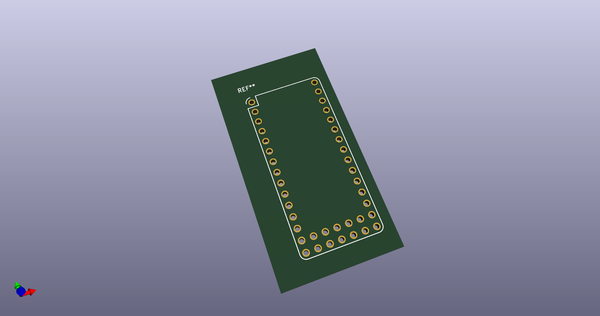
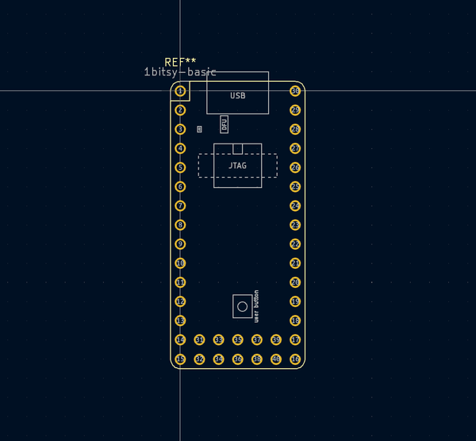
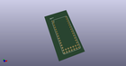
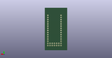
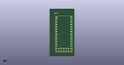

# OOMP Footprint  
## 1bitsy-basic  by 1Bitsy  
  
oomp key: oomp_1bitsy_1bitsy_1bitsy_basic  
  
source repo at: [http://github.com/1Bitsy/1bitsy-hardware-lib/blob/master/tmp/data//oomlout_oomp_footprint_src/kicad/1bitsy.pretty/1bitsy.kicad_mod](http://github.com/1Bitsy/1bitsy-hardware-lib/blob/master/tmp/data//oomlout_oomp_footprint_src/kicad/1bitsy.pretty/1bitsy.kicad_mod)  
## Footprint  
  
  
  
  
| name | value | 
| --- | --- | 
| footprint name | 1bitsy-basic | 
| footprint description | 1Bitsy footprint containing only the primary pins | 
| number of pads | 40 | 
| github path | http://github.com/1Bitsy/1bitsy-hardware-lib/blob/master/tmp/data//oomlout_oomp_footprint_src/kicad/1bitsy.pretty/1bitsy-basic.kicad_mod | 
| oomp key | oomp_1bitsy_1bitsy_1bitsy_basic | 
| oomp bot github | https://github.com/oomlout/oomlout_oomp_footprint_bot/tree/main/tmp/data//oomlout_oomp_footprint_src/footprints/1bitsy_1bitsy_1bitsy_basic/working | 
## Images  
  
  
  
  
  
  
  
  
