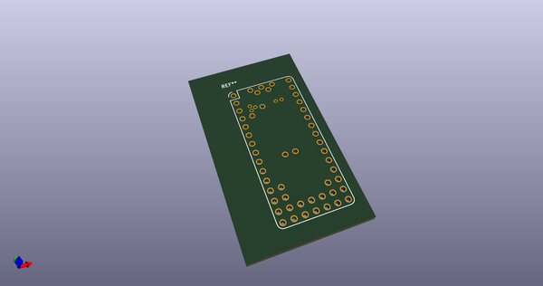
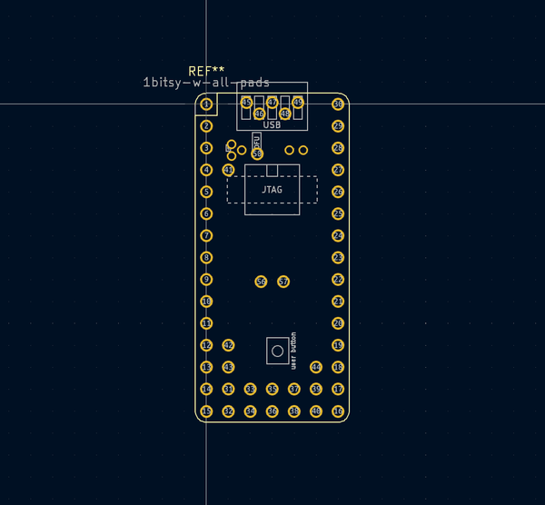
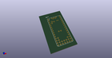
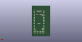
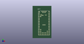

# OOMP Footprint  
## 1bitsy-w-all-pads  by 1Bitsy  
  
oomp key: oomp_1bitsy_1bitsy_1bitsy_w_all_pads  
  
source repo at: [http://github.com/1Bitsy/1bitsy-hardware-lib/blob/master/tmp/data/oomlout_oomp_footprint_src/kicad/1bitsy.pretty/1bitsy.kicad_mod](http://github.com/1Bitsy/1bitsy-hardware-lib/blob/master/tmp/data/oomlout_oomp_footprint_src/kicad/1bitsy.pretty/1bitsy.kicad_mod)  
## Footprint  
  
  
  
  
| name | value | 
| --- | --- | 
| footprint name | 1bitsy-w-all-pads | 
| footprint description | 1Bitsy with all pads. Can be used to connect to all exposed signals of the 1Bitsy | 
| number of pads | 57 | 
| github path | http://github.com/1Bitsy/1bitsy-hardware-lib/blob/master/tmp/data/oomlout_oomp_footprint_src/kicad/1bitsy.pretty/1bitsy-w-all-pads.kicad_mod | 
| oomp key | oomp_1bitsy_1bitsy_1bitsy_w_all_pads | 
| oomp bot github | https://github.com/oomlout/oomlout_oomp_footprint_bot/tree/main/tmp/data/oomlout_oomp_footprint_src/footprints/1bitsy_1bitsy_1bitsy_w_all_pads/working | 
## Images  
  
  
  
  
  
  
  
  
