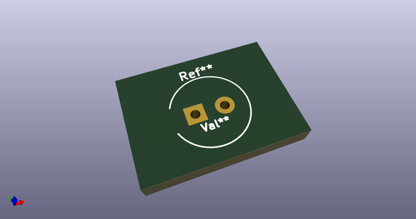
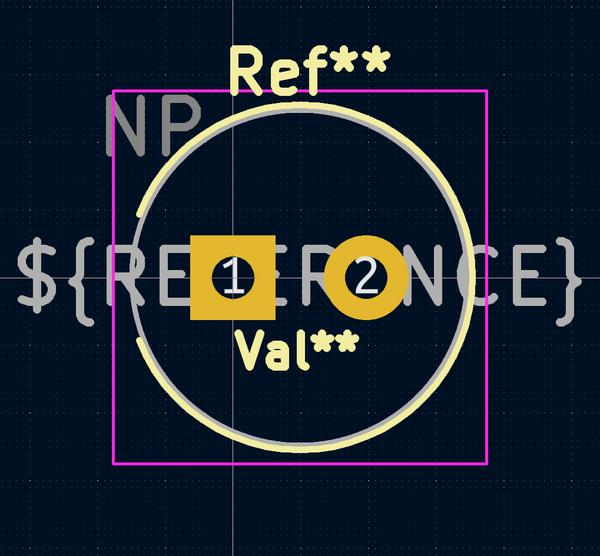
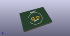

# OOMP Footprint  
## CP_Radial_NP_D6.3mm_P2.50mm  by 4ms  
  
oomp key: oomp_4ms_4ms_capacitor_cp_radial_np_d6_3mm_p2_50mm  
  
source repo at: [http://github.com/4ms/4ms-kicad-lib/blob/master/tmp/data//oomlout_oomp_footprint_src/footprints-legacy/4ms-legacy-footprints.pretty/wire-hole.kicad_mod](http://github.com/4ms/4ms-kicad-lib/blob/master/tmp/data//oomlout_oomp_footprint_src/footprints-legacy/4ms-legacy-footprints.pretty/wire-hole.kicad_mod)  
## Footprint  
  
  
  
  
| name | value | 
| --- | --- | 
| footprint name | CP_Radial_NP_D6.3mm_P2.50mm | 
| footprint description | CP, Radial series, Radial, pin pitch=2.50mm, , diameter=6.3mm, Electrolytic Capacitor | 
| number of pads | 2 | 
| github path | http://github.com/4ms/4ms-kicad-lib/blob/master/tmp/data//oomlout_oomp_footprint_src/footprints/4ms_Capacitor.pretty/CP_Radial_NP_D6.3mm_P2.50mm.kicad_mod | 
| oomp key | oomp_4ms_4ms_capacitor_cp_radial_np_d6_3mm_p2_50mm | 
| oomp bot github | https://github.com/oomlout/oomlout_oomp_footprint_bot/tree/main/tmp/data//oomlout_oomp_footprint_src/footprints/4ms_4ms_capacitor_cp_radial_np_d6_3mm_p2_50mm/working | 
## Images  
  
  
  
  
  
  
  
  
