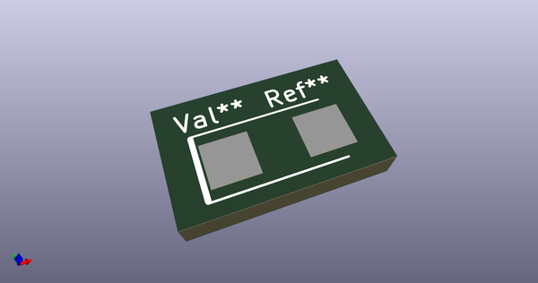
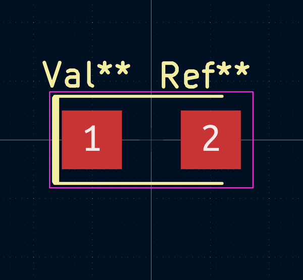
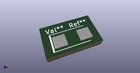

# OOMP Footprint  
## CP_Tantalum_EIA-6032-28_Kemet-C  by 4ms  
  
oomp key: oomp_4ms_4ms_capacitor_cp_tantalum_eia_6032_28_kemet_c  
  
source repo at: [http://github.com/4ms/4ms-kicad-lib/blob/master/tmp/data//oomlout_oomp_footprint_src/footprints-legacy/4ms-legacy-footprints.pretty/wire-hole.kicad_mod](http://github.com/4ms/4ms-kicad-lib/blob/master/tmp/data//oomlout_oomp_footprint_src/footprints-legacy/4ms-legacy-footprints.pretty/wire-hole.kicad_mod)  
## Footprint  
  
  
  
  
| name | value | 
| --- | --- | 
| footprint name | CP_Tantalum_EIA-6032-28_Kemet-C | 
| footprint description | Tantalum capacitor, Case C, EIA 6032-28, 6.0x3.2x2.5mm, Reflow soldering footprint | 
| number of pads | 2 | 
| github path | http://github.com/4ms/4ms-kicad-lib/blob/master/tmp/data//oomlout_oomp_footprint_src/footprints/4ms_Capacitor.pretty/CP_Tantalum_EIA-6032-28_Kemet-C.kicad_mod | 
| oomp key | oomp_4ms_4ms_capacitor_cp_tantalum_eia_6032_28_kemet_c | 
| oomp bot github | https://github.com/oomlout/oomlout_oomp_footprint_bot/tree/main/tmp/data//oomlout_oomp_footprint_src/footprints/4ms_4ms_capacitor_cp_tantalum_eia_6032_28_kemet_c/working | 
## Images  
  
  
  
  
  
  
  
  
