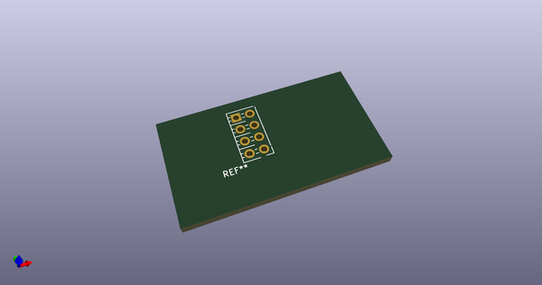
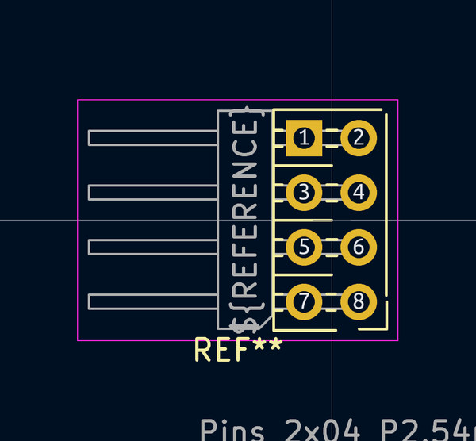
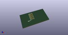

# OOMP Footprint  
## Pins_2x04_P2.54mm_Horizontal_altL_CroppedSilk  by none  
  
oomp key: oomp_4ms_4ms_connector_pins_2x04_p2_54mm_horizontal_altl_croppedsilk  
  
source repo at: [http://gitlab.com/4ms/4ms-kicad-lib/blob/master/tmp/data//oomlout_oomp_footprint_src/footprints-legacy/4ms-legacy-footprints.pretty/wire-hole.kicad_mod](http://gitlab.com/4ms/4ms-kicad-lib/blob/master/tmp/data//oomlout_oomp_footprint_src/footprints-legacy/4ms-legacy-footprints.pretty/wire-hole.kicad_mod)  
## Footprint  
  
  
  
  
| name | value | 
| --- | --- | 
| footprint name | Pins_2x04_P2.54mm_Horizontal_altL_CroppedSilk | 
| footprint description | Through hole angled pin header, 2x04, 2.54mm pitch, 6mm pin length, double rows, Pins point left when pin 1 is up | 
| number of pads | 8 | 
| github path | http://github.com/4ms/4ms-kicad-lib/blob/master/tmp/data//oomlout_oomp_footprint_src/footprints/4ms_Connector.pretty/Pins_2x04_P2.54mm_Horizontal_altL_CroppedSilk.kicad_mod | 
| oomp key | oomp_4ms_4ms_connector_pins_2x04_p2_54mm_horizontal_altl_croppedsilk | 
| oomp bot github | https://github.com/oomlout/oomlout_oomp_footprint_bot/tree/main/tmp/data//oomlout_oomp_footprint_src/footprints/4ms_4ms_connector_pins_2x04_p2_54mm_horizontal_altl_croppedsilk/working | 
## Images  
  
  
  
  
  
  
  
  
