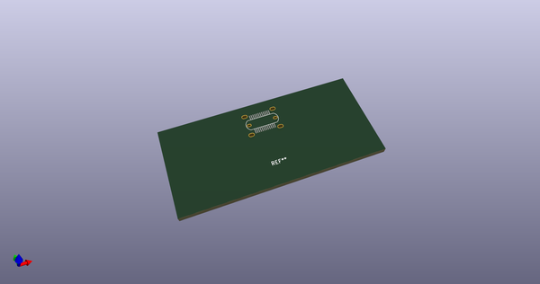
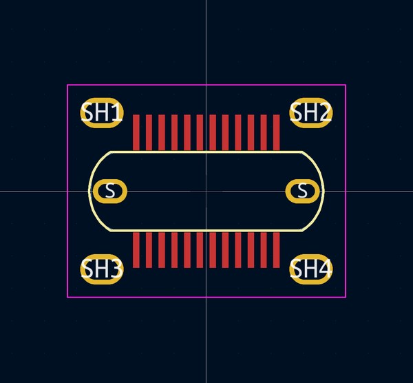
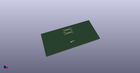

# OOMP Footprint  
## USB_C_Receptacle_AdamTech_USB-C31-S-VT-CS4-BK-PP  by none  
  
oomp key: oomp_4ms_4ms_connector_usb_c_receptacle_adamtech_usb_c31_s_vt_cs4_bk_pp  
  
source repo at: [http://gitlab.com/4ms/4ms-kicad-lib/blob/master/tmp/data//oomlout_oomp_footprint_src/footprints-legacy/4ms-legacy-footprints.pretty/wire-hole.kicad_mod](http://gitlab.com/4ms/4ms-kicad-lib/blob/master/tmp/data//oomlout_oomp_footprint_src/footprints-legacy/4ms-legacy-footprints.pretty/wire-hole.kicad_mod)  
## Footprint  
  
  
  
  
| name | value | 
| --- | --- | 
| footprint name | USB_C_Receptacle_AdamTech_USB-C31-S-VT-CS4-BK-PP | 
| footprint description | None | 
| number of pads | 30 | 
| github path | http://github.com/4ms/4ms-kicad-lib/blob/master/tmp/data//oomlout_oomp_footprint_src/footprints/4ms_Connector.pretty/USB_C_Receptacle_AdamTech_USB-C31-S-VT-CS4-BK-PP.kicad_mod | 
| oomp key | oomp_4ms_4ms_connector_usb_c_receptacle_adamtech_usb_c31_s_vt_cs4_bk_pp | 
| oomp bot github | https://github.com/oomlout/oomlout_oomp_footprint_bot/tree/main/tmp/data//oomlout_oomp_footprint_src/footprints/4ms_4ms_connector_usb_c_receptacle_adamtech_usb_c31_s_vt_cs4_bk_pp/working | 
## Images  
  
  
  
  
  
  
  
  
