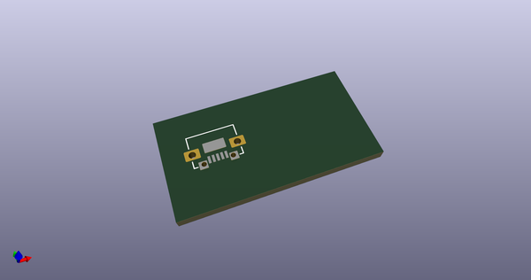
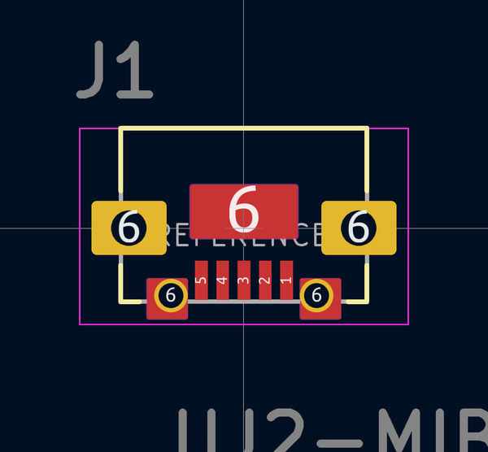
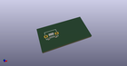

# OOMP Footprint  
## USB_Micro-B_CUI_UJ2-MIBH2-4-SMT  by 4ms  
  
oomp key: oomp_4ms_4ms_connector_usb_micro_b_cui_uj2_mibh2_4_smt  
  
source repo at: [http://github.com/4ms/4ms-kicad-lib/blob/master/tmp/data/oomlout_oomp_footprint_src/footprints-legacy/4ms-legacy-footprints.pretty/wire-hole.kicad_mod](http://github.com/4ms/4ms-kicad-lib/blob/master/tmp/data/oomlout_oomp_footprint_src/footprints-legacy/4ms-legacy-footprints.pretty/wire-hole.kicad_mod)  
## Footprint  
  
  
  
  
| name | value | 
| --- | --- | 
| footprint name | USB_Micro-B_CUI_UJ2-MIBH2-4-SMT | 
| footprint description | None | 
| number of pads | 12 | 
| github path | http://github.com/4ms/4ms-kicad-lib/blob/master/tmp/data/oomlout_oomp_footprint_src/footprints/4ms_Connector.pretty/USB_Micro-B_CUI_UJ2-MIBH2-4-SMT.kicad_mod | 
| oomp key | oomp_4ms_4ms_connector_usb_micro_b_cui_uj2_mibh2_4_smt | 
| oomp bot github | https://github.com/oomlout/oomlout_oomp_footprint_bot/tree/main/tmp/data/oomlout_oomp_footprint_src/footprints/4ms_4ms_connector_usb_micro_b_cui_uj2_mibh2_4_smt/working | 
## Images  
  
  
  
  
  
  
  
  
