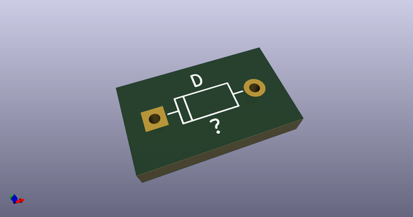
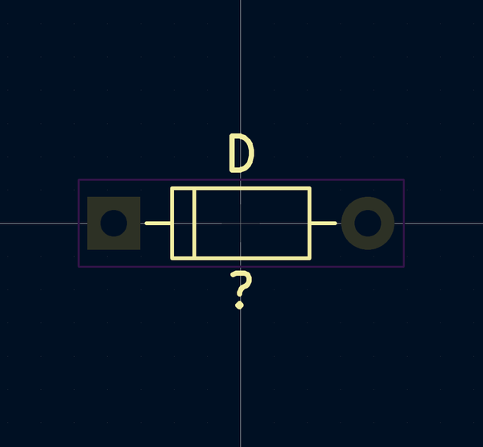
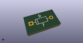
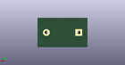
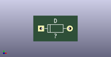

# OOMP Footprint  
## D_DO-35_P7.62mm_Horizontal  by 4ms  
  
oomp key: oomp_4ms_4ms_diode_d_do_35_p7_62mm_horizontal  
  
source repo at: [http://github.com/4ms/4ms-kicad-lib/blob/master/tmp/data//oomlout_oomp_footprint_src/footprints-legacy/4ms-legacy-footprints.pretty/wire-hole.kicad_mod](http://github.com/4ms/4ms-kicad-lib/blob/master/tmp/data//oomlout_oomp_footprint_src/footprints-legacy/4ms-legacy-footprints.pretty/wire-hole.kicad_mod)  
## Footprint  
  
  
  
  
| name | value | 
| --- | --- | 
| footprint name | D_DO-35_P7.62mm_Horizontal | 
| footprint description | D, DO-35_SOD27 series, Axial, Horizontal, pin pitch=7.62mm, , length*diameter=4*2mm^2, , http://www.diodes.com/_files/packages/DO-35.pdf | 
| number of pads | 2 | 
| github path | http://github.com/4ms/4ms-kicad-lib/blob/master/tmp/data//oomlout_oomp_footprint_src/footprints/4ms_Diode.pretty/D_DO-35_P7.62mm_Horizontal.kicad_mod | 
| oomp key | oomp_4ms_4ms_diode_d_do_35_p7_62mm_horizontal | 
| oomp bot github | https://github.com/oomlout/oomlout_oomp_footprint_bot/tree/main/tmp/data//oomlout_oomp_footprint_src/footprints/4ms_4ms_diode_d_do_35_p7_62mm_horizontal/working | 
## Images  
  
  
  
  
  
  
  
  
