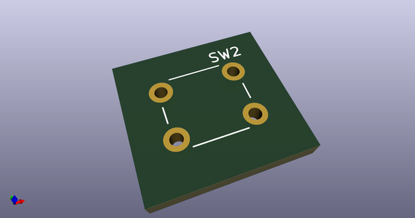
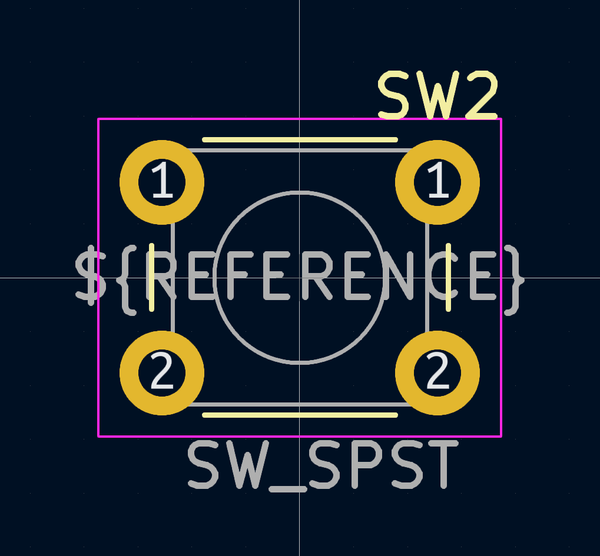
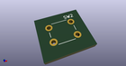
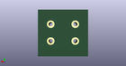
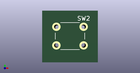

# OOMP Footprint  
## SW_PUSH_6mm_H13mm  by 4ms  
  
oomp key: oomp_4ms_4ms_experimental_fp_sw_push_6mm_h13mm  
  
source repo at: [http://github.com/4ms/4ms-kicad-lib/blob/master/tmp/data//oomlout_oomp_footprint_src/footprints-legacy/4ms-legacy-footprints.pretty/wire-hole.kicad_mod](http://github.com/4ms/4ms-kicad-lib/blob/master/tmp/data//oomlout_oomp_footprint_src/footprints-legacy/4ms-legacy-footprints.pretty/wire-hole.kicad_mod)  
## Footprint  
  
  
  
  
| name | value | 
| --- | --- | 
| footprint name | SW_PUSH_6mm_H13mm | 
| footprint description | tactile push button, 6x6mm e.g. PHAP33xx series, height=13mm | 
| number of pads | 4 | 
| github path | http://github.com/4ms/4ms-kicad-lib/blob/master/tmp/data//oomlout_oomp_footprint_src/footprints/4ms_Experimental_FP.pretty/SW_PUSH_6mm_H13mm.kicad_mod | 
| oomp key | oomp_4ms_4ms_experimental_fp_sw_push_6mm_h13mm | 
| oomp bot github | https://github.com/oomlout/oomlout_oomp_footprint_bot/tree/main/tmp/data//oomlout_oomp_footprint_src/footprints/4ms_4ms_experimental_fp_sw_push_6mm_h13mm/working | 
## Images  
  
  
  
  
  
  
