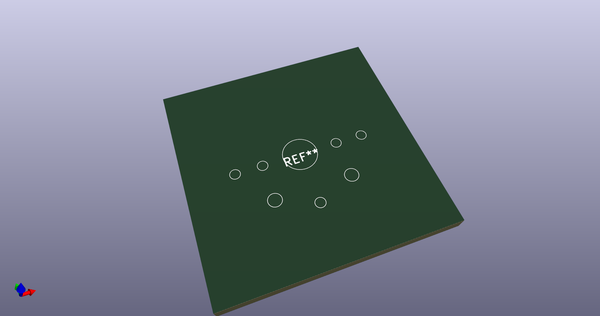
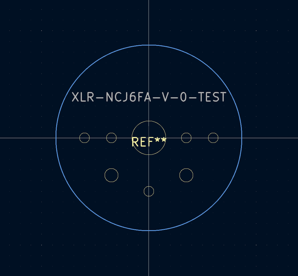

# OOMP Footprint  
## XLR-NCJ6FA-V-0-TEST  by 4ms  
  
oomp key: oomp_4ms_4ms_experimental_fp_xlr_ncj6fa_v_0_test  
  
source repo at: [http://github.com/4ms/4ms-kicad-lib/blob/master/tmp/data//oomlout_oomp_footprint_src/footprints-legacy/4ms-legacy-footprints.pretty/wire-hole.kicad_mod](http://github.com/4ms/4ms-kicad-lib/blob/master/tmp/data//oomlout_oomp_footprint_src/footprints-legacy/4ms-legacy-footprints.pretty/wire-hole.kicad_mod)  
## Footprint  
  
  
  
  
| name | value | 
| --- | --- | 
| footprint name | XLR-NCJ6FA-V-0-TEST | 
| footprint description | None | 
| number of pads | 0 | 
| github path | http://github.com/4ms/4ms-kicad-lib/blob/master/tmp/data//oomlout_oomp_footprint_src/footprints/4ms_Experimental_FP.pretty/XLR-NCJ6FA-V-0-TEST.kicad_mod | 
| oomp key | oomp_4ms_4ms_experimental_fp_xlr_ncj6fa_v_0_test | 
| oomp bot github | https://github.com/oomlout/oomlout_oomp_footprint_bot/tree/main/tmp/data//oomlout_oomp_footprint_src/footprints/4ms_4ms_experimental_fp_xlr_ncj6fa_v_0_test/working | 
## Images  
  
  
  
  
  
  
  
  
