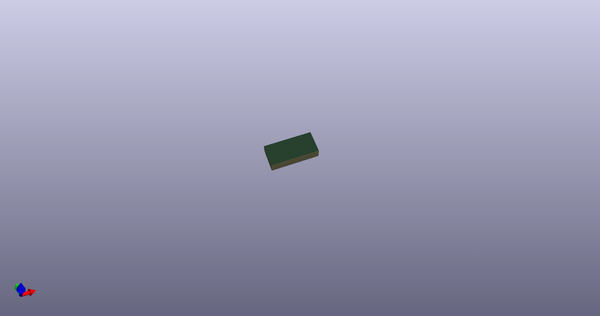
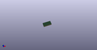

# OOMP Footprint  
## Faceplate_Slide_Switch_MS2201L6_Nexsun  by 4ms  
  
oomp key: oomp_4ms_4ms_faceplate_faceplate_slide_switch_ms2201l6_nexsun  
  
source repo at: [http://github.com/4ms/4ms-kicad-lib/blob/master/tmp/data/oomlout_oomp_footprint_src/footprints-legacy/4ms-legacy-footprints.pretty/wire-hole.kicad_mod](http://github.com/4ms/4ms-kicad-lib/blob/master/tmp/data/oomlout_oomp_footprint_src/footprints-legacy/4ms-legacy-footprints.pretty/wire-hole.kicad_mod)  
## Footprint  
  
  
  
  
| name | value | 
| --- | --- | 
| footprint name | Faceplate_Slide_Switch_MS2201L6_Nexsun | 
| footprint description | None | 
| number of pads | 0 | 
| github path | http://github.com/4ms/4ms-kicad-lib/blob/master/tmp/data/oomlout_oomp_footprint_src/footprints/4ms_Faceplate.pretty/Faceplate_Slide_Switch_MS2201L6_Nexsun.kicad_mod | 
| oomp key | oomp_4ms_4ms_faceplate_faceplate_slide_switch_ms2201l6_nexsun | 
| oomp bot github | https://github.com/oomlout/oomlout_oomp_footprint_bot/tree/main/tmp/data/oomlout_oomp_footprint_src/footprints/4ms_4ms_faceplate_faceplate_slide_switch_ms2201l6_nexsun/working | 
## Images  
  
  
  
  
  
  
  
  
