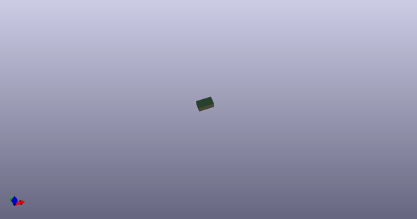
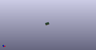

# OOMP Footprint  
## Faceplate_Slide_Switch_SS22D06-G?-H_Runrun  by none  
  
oomp key: oomp_4ms_4ms_faceplate_faceplate_slide_switch_ss22d06_runrun  
  
source repo at: [http://gitlab.com/4ms/4ms-kicad-lib/blob/master/tmp/data//oomlout_oomp_footprint_src/footprints-legacy/4ms-legacy-footprints.pretty/wire-hole.kicad_mod](http://gitlab.com/4ms/4ms-kicad-lib/blob/master/tmp/data//oomlout_oomp_footprint_src/footprints-legacy/4ms-legacy-footprints.pretty/wire-hole.kicad_mod)  
## Footprint  
  
  
  
  
| name | value | 
| --- | --- | 
| footprint name | Faceplate_Slide_Switch_SS22D06-G?-H_Runrun | 
| footprint description | None | 
| number of pads | 0 | 
| github path | http://github.com/4ms/4ms-kicad-lib/blob/master/tmp/data//oomlout_oomp_footprint_src/footprints/4ms_Faceplate.pretty/Faceplate_Slide_Switch_SS22D06_Runrun.kicad_mod | 
| oomp key | oomp_4ms_4ms_faceplate_faceplate_slide_switch_ss22d06_runrun | 
| oomp bot github | https://github.com/oomlout/oomlout_oomp_footprint_bot/tree/main/tmp/data//oomlout_oomp_footprint_src/footprints/4ms_4ms_faceplate_faceplate_slide_switch_ss22d06_runrun/working | 
## Images  
  
  
  
  
  
  
  
  
