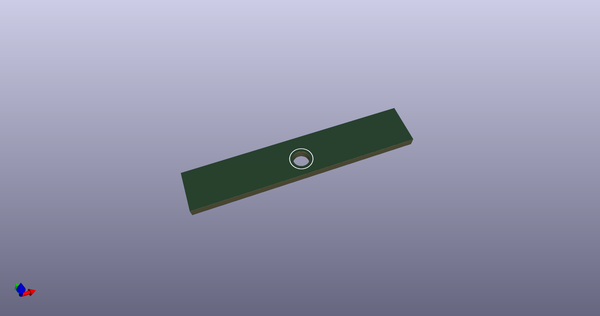
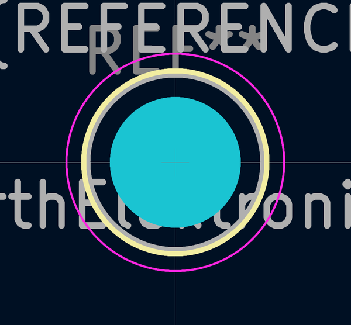
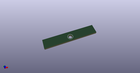

# OOMP Footprint  
## MountingHole_WurthElektronik_WA-SNSR_3mm  by none  
  
oomp key: oomp_4ms_4ms_hardware_mountinghole_wurthelektronik_wa_snsr_3mm  
  
source repo at: [http://gitlab.com/4ms/4ms-kicad-lib/blob/master/tmp/data//oomlout_oomp_footprint_src/footprints-legacy/4ms-legacy-footprints.pretty/wire-hole.kicad_mod](http://gitlab.com/4ms/4ms-kicad-lib/blob/master/tmp/data//oomlout_oomp_footprint_src/footprints-legacy/4ms-legacy-footprints.pretty/wire-hole.kicad_mod)  
## Footprint  
  
  
  
  
| name | value | 
| --- | --- | 
| footprint name | MountingHole_WurthElektronik_WA-SNSR_3mm | 
| footprint description | Mounting hole for a self-retaining space of the Wurth Elektronik WA-SNSR family with a drill diameter of 3mm | 
| number of pads | 1 | 
| github path | http://github.com/4ms/4ms-kicad-lib/blob/master/tmp/data//oomlout_oomp_footprint_src/footprints/4ms_Hardware.pretty/MountingHole_WurthElektronik_WA-SNSR_3mm.kicad_mod | 
| oomp key | oomp_4ms_4ms_hardware_mountinghole_wurthelektronik_wa_snsr_3mm | 
| oomp bot github | https://github.com/oomlout/oomlout_oomp_footprint_bot/tree/main/tmp/data//oomlout_oomp_footprint_src/footprints/4ms_4ms_hardware_mountinghole_wurthelektronik_wa_snsr_3mm/working | 
## Images  
  
  
  
  
  
  
  
  
