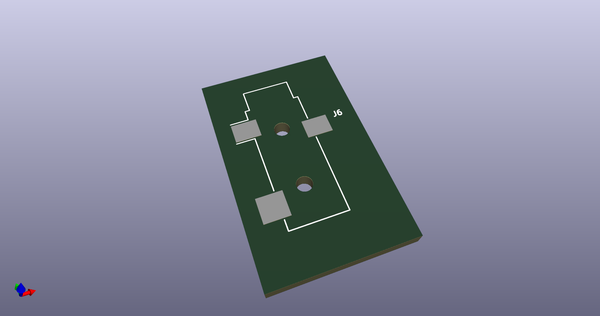
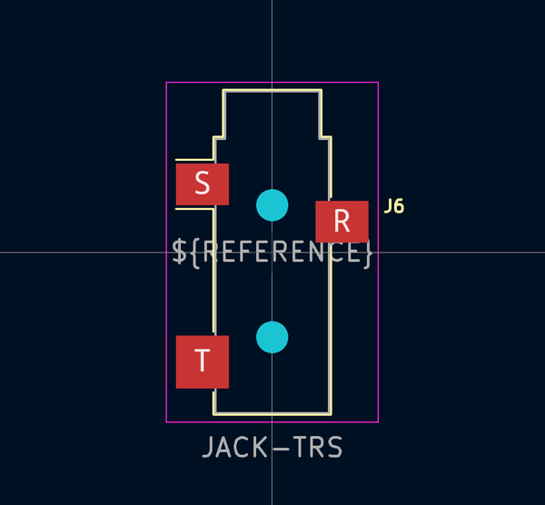
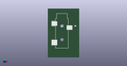

# OOMP Footprint  
## Jack_3.5mm_CUI_SJ-3523-SMT_Horizontal  by 4ms  
  
oomp key: oomp_4ms_4ms_jack_jack_3_5mm_cui_sj_3523_smt_horizontal  
  
source repo at: [http://github.com/4ms/4ms-kicad-lib/blob/master/tmp/data//oomlout_oomp_footprint_src/footprints-legacy/4ms-legacy-footprints.pretty/wire-hole.kicad_mod](http://github.com/4ms/4ms-kicad-lib/blob/master/tmp/data//oomlout_oomp_footprint_src/footprints-legacy/4ms-legacy-footprints.pretty/wire-hole.kicad_mod)  
## Footprint  
  
  
  
  
| name | value | 
| --- | --- | 
| footprint name | Jack_3.5mm_CUI_SJ-3523-SMT_Horizontal | 
| footprint description | 3.5 mm, Stereo, Right Angle, Surface Mount (SMT), Audio Jack Connector (https://www.cui.com/product/resource/sj-352x-smt-series.pdf) | 
| number of pads | 5 | 
| github path | http://github.com/4ms/4ms-kicad-lib/blob/master/tmp/data//oomlout_oomp_footprint_src/footprints/4ms_Jack.pretty/Jack_3.5mm_CUI_SJ-3523-SMT_Horizontal.kicad_mod | 
| oomp key | oomp_4ms_4ms_jack_jack_3_5mm_cui_sj_3523_smt_horizontal | 
| oomp bot github | https://github.com/oomlout/oomlout_oomp_footprint_bot/tree/main/tmp/data//oomlout_oomp_footprint_src/footprints/4ms_4ms_jack_jack_3_5mm_cui_sj_3523_smt_horizontal/working | 
## Images  
  
  
  
  
  
  
  
  
