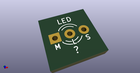

# OOMP Footprint  
## LED_3mm_Dual_3pin_MLS  by 4ms  
  
oomp key: oomp_4ms_4ms_led_led_3mm_dual_3pin_mls  
  
source repo at: [http://github.com/4ms/4ms-kicad-lib/blob/master/tmp/data//oomlout_oomp_footprint_src/footprints-legacy/4ms-legacy-footprints.pretty/wire-hole.kicad_mod](http://github.com/4ms/4ms-kicad-lib/blob/master/tmp/data//oomlout_oomp_footprint_src/footprints-legacy/4ms-legacy-footprints.pretty/wire-hole.kicad_mod)  
## Footprint  
  
  
  
  
| name | value | 
| --- | --- | 
| footprint name | LED_3mm_Dual_3pin_MLS | 
| footprint description | LED, diameter 3.0mm, 2 pins, diameter 3.0mm, 3 pins, http://www.kingbright.com/attachments/file/psearch/000/00/00/L-3VSURKCGKC(Ver.8A).pdf | 
| number of pads | 3 | 
| github path | http://github.com/4ms/4ms-kicad-lib/blob/master/tmp/data//oomlout_oomp_footprint_src/footprints/4ms_LED.pretty/LED_3mm_Dual_3pin_MLS.kicad_mod | 
| oomp key | oomp_4ms_4ms_led_led_3mm_dual_3pin_mls | 
| oomp bot github | https://github.com/oomlout/oomlout_oomp_footprint_bot/tree/main/tmp/data//oomlout_oomp_footprint_src/footprints/4ms_4ms_led_led_3mm_dual_3pin_mls/working | 
## Images  
  
  
  
  
  
  
  
  
