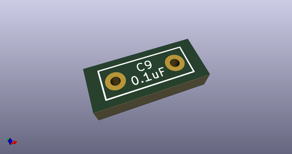
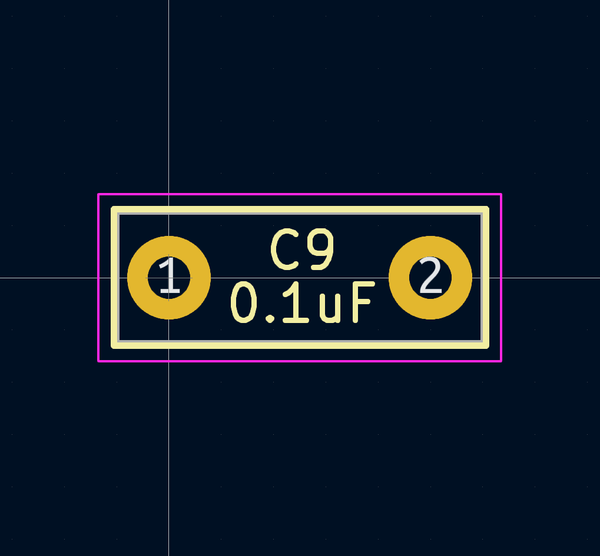
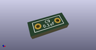
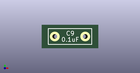

# OOMP Footprint  
## Cap_Ceramic_TH  by none  
  
oomp key: oomp_4ms_4ms_legacy_footprints_cap_ceramic_th  
  
source repo at: [http://gitlab.com/4ms/4ms-kicad-lib/blob/master/tmp/data//oomlout_oomp_footprint_src/footprints-legacy/4ms-legacy-footprints.pretty/wire-hole.kicad_mod](http://gitlab.com/4ms/4ms-kicad-lib/blob/master/tmp/data//oomlout_oomp_footprint_src/footprints-legacy/4ms-legacy-footprints.pretty/wire-hole.kicad_mod)  
## Footprint  
  
  
  
  
| name | value | 
| --- | --- | 
| footprint name | Cap_Ceramic_TH | 
| footprint description | C, Disc series, Radial, pin pitch=5.00mm, , diameter*width=7*2.5mm^2, Capacitor, http://cdn-reichelt.de/documents/datenblatt/B300/DS_KERKO_TC.pdf | 
| number of pads | 2 | 
| github path | http://github.com/4ms/4ms-kicad-lib/blob/master/tmp/data//oomlout_oomp_footprint_src/footprints-legacy/4ms-legacy-footprints.pretty/Cap_Ceramic_TH.kicad_mod | 
| oomp key | oomp_4ms_4ms_legacy_footprints_cap_ceramic_th | 
| oomp bot github | https://github.com/oomlout/oomlout_oomp_footprint_bot/tree/main/tmp/data//oomlout_oomp_footprint_src/footprints/4ms_4ms_legacy_footprints_cap_ceramic_th/working | 
## Images  
  
  
  
  
  
  
  
  
