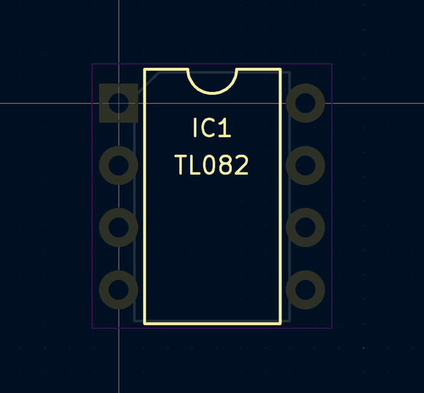
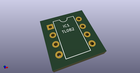

# OOMP Footprint  
## DIP_8pin_TL082_TH  by 4ms  
  
oomp key: oomp_4ms_4ms_legacy_footprints_dip_8pin_tl082_th  
  
source repo at: [http://github.com/4ms/4ms-kicad-lib/blob/master/tmp/data/oomlout_oomp_footprint_src/footprints-legacy/4ms-legacy-footprints.pretty/wire-hole.kicad_mod](http://github.com/4ms/4ms-kicad-lib/blob/master/tmp/data/oomlout_oomp_footprint_src/footprints-legacy/4ms-legacy-footprints.pretty/wire-hole.kicad_mod)  
## Footprint  
  
  
  
  
| name | value | 
| --- | --- | 
| footprint name | DIP_8pin_TL082_TH | 
| footprint description | 8-lead dip package, row spacing 7.62 mm (300 mils) | 
| number of pads | 8 | 
| github path | http://github.com/4ms/4ms-kicad-lib/blob/master/tmp/data/oomlout_oomp_footprint_src/footprints-legacy/4ms-legacy-footprints.pretty/DIP_8pin_TL082_TH.kicad_mod | 
| oomp key | oomp_4ms_4ms_legacy_footprints_dip_8pin_tl082_th | 
| oomp bot github | https://github.com/oomlout/oomlout_oomp_footprint_bot/tree/main/tmp/data/oomlout_oomp_footprint_src/footprints/4ms_4ms_legacy_footprints_dip_8pin_tl082_th/working | 
## Images  
  
  
  
  
  
  
  
  
