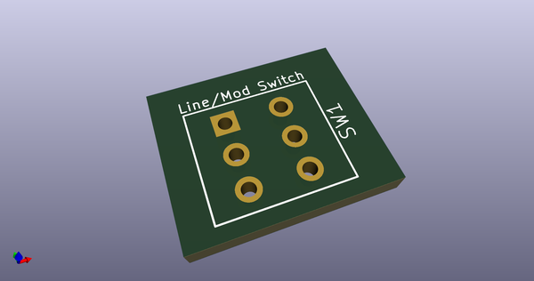
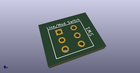
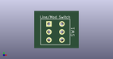

# OOMP Footprint  
## DPDT_Toggle_108-2MD1T2B3M1QE-EVX  by none  
  
oomp key: oomp_4ms_4ms_legacy_footprints_dpdt_toggle_108_2md1t2b3m1qe_evx  
  
source repo at: [http://gitlab.com/4ms/4ms-kicad-lib/blob/master/tmp/data//oomlout_oomp_footprint_src/footprints-legacy/4ms-legacy-footprints.pretty/wire-hole.kicad_mod](http://gitlab.com/4ms/4ms-kicad-lib/blob/master/tmp/data//oomlout_oomp_footprint_src/footprints-legacy/4ms-legacy-footprints.pretty/wire-hole.kicad_mod)  
## Footprint  
  
  
  
  
| name | value | 
| --- | --- | 
| footprint name | DPDT_Toggle_108-2MD1T2B3M1QE-EVX | 
| footprint description | Through hole straight pin header, 2x03, 2.54mm pitch, double rows | 
| number of pads | 6 | 
| github path | http://github.com/4ms/4ms-kicad-lib/blob/master/tmp/data//oomlout_oomp_footprint_src/footprints-legacy/4ms-legacy-footprints.pretty/DPDT_Toggle_108-2MD1T2B3M1QE-EVX.kicad_mod | 
| oomp key | oomp_4ms_4ms_legacy_footprints_dpdt_toggle_108_2md1t2b3m1qe_evx | 
| oomp bot github | https://github.com/oomlout/oomlout_oomp_footprint_bot/tree/main/tmp/data//oomlout_oomp_footprint_src/footprints/4ms_4ms_legacy_footprints_dpdt_toggle_108_2md1t2b3m1qe_evx/working | 
## Images  
  
  
  
  
  
  
  
  
