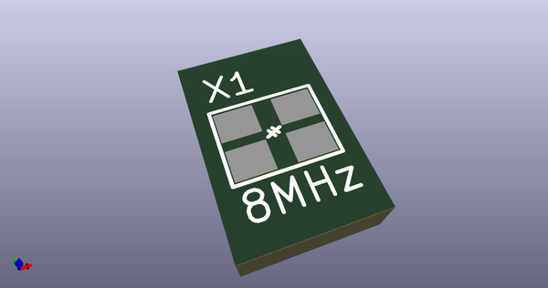
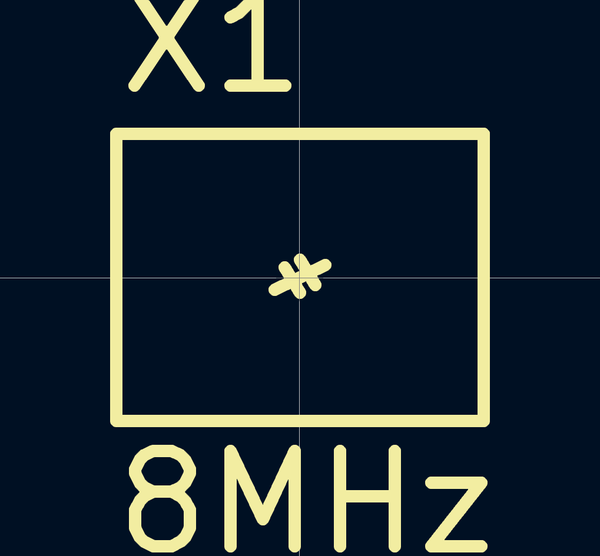
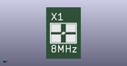

# OOMP Footprint  
## FA-238-Pins1and2diag  by 4ms  
  
oomp key: oomp_4ms_4ms_legacy_footprints_fa_238_pins1and2diag  
  
source repo at: [http://github.com/4ms/4ms-kicad-lib/blob/master/tmp/data//oomlout_oomp_footprint_src/footprints-legacy/4ms-legacy-footprints.pretty/wire-hole.kicad_mod](http://github.com/4ms/4ms-kicad-lib/blob/master/tmp/data//oomlout_oomp_footprint_src/footprints-legacy/4ms-legacy-footprints.pretty/wire-hole.kicad_mod)  
## Footprint  
  
  
  
  
| name | value | 
| --- | --- | 
| footprint name | FA-238-Pins1and2diag | 
| footprint description | None | 
| number of pads | 4 | 
| github path | http://github.com/4ms/4ms-kicad-lib/blob/master/tmp/data//oomlout_oomp_footprint_src/footprints-legacy/4ms-legacy-footprints.pretty/FA-238-Pins1and2diag.kicad_mod | 
| oomp key | oomp_4ms_4ms_legacy_footprints_fa_238_pins1and2diag | 
| oomp bot github | https://github.com/oomlout/oomlout_oomp_footprint_bot/tree/main/tmp/data//oomlout_oomp_footprint_src/footprints/4ms_4ms_legacy_footprints_fa_238_pins1and2diag/working | 
## Images  
  
  
  
  
  
  
  
  
