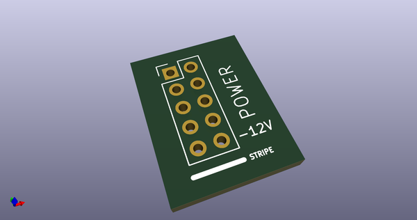
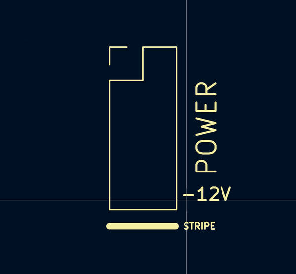
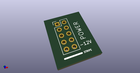
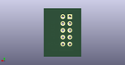
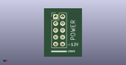

# OOMP Footprint  
## Header_2x05_Pitch2.54mm_TH_-12v_Label  by 4ms  
  
oomp key: oomp_4ms_4ms_legacy_footprints_header_2x05_pitch2_54mm_th_12v_label  
  
source repo at: [http://github.com/4ms/4ms-kicad-lib/blob/master/tmp/data/oomlout_oomp_footprint_src/footprints-legacy/4ms-legacy-footprints.pretty/wire-hole.kicad_mod](http://github.com/4ms/4ms-kicad-lib/blob/master/tmp/data/oomlout_oomp_footprint_src/footprints-legacy/4ms-legacy-footprints.pretty/wire-hole.kicad_mod)  
## Footprint  
  
  
  
  
| name | value | 
| --- | --- | 
| footprint name | Header_2x05_Pitch2.54mm_TH_-12v_Label | 
| footprint description | Through hole straight pin header, 2x05, 2.54mm pitch, double rows | 
| number of pads | 10 | 
| github path | http://github.com/4ms/4ms-kicad-lib/blob/master/tmp/data/oomlout_oomp_footprint_src/footprints-legacy/4ms-legacy-footprints.pretty/Header_2x05_Pitch2.54mm_TH_-12v_Label.kicad_mod | 
| oomp key | oomp_4ms_4ms_legacy_footprints_header_2x05_pitch2_54mm_th_12v_label | 
| oomp bot github | https://github.com/oomlout/oomlout_oomp_footprint_bot/tree/main/tmp/data/oomlout_oomp_footprint_src/footprints/4ms_4ms_legacy_footprints_header_2x05_pitch2_54mm_th_12v_label/working | 
## Images  
  
  
  
  
  
  
  
  
