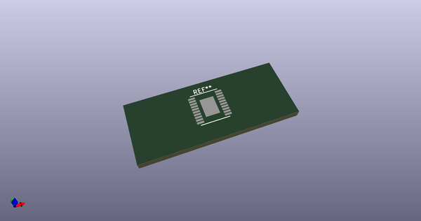
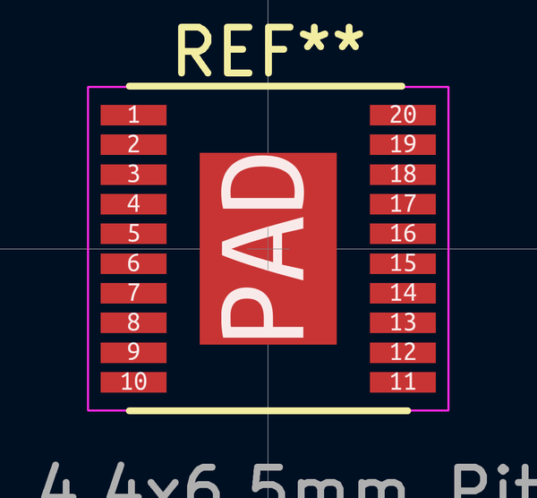

# OOMP Footprint  
## HTSSOP-20-EP_4.4x6.5mm_Pitch0.65mm  by none  
  
oomp key: oomp_4ms_4ms_legacy_footprints_htssop_20_ep_4_4x6_5mm_pitch0_65mm  
  
source repo at: [http://gitlab.com/4ms/4ms-kicad-lib/blob/master/tmp/data//oomlout_oomp_footprint_src/footprints-legacy/4ms-legacy-footprints.pretty/wire-hole.kicad_mod](http://gitlab.com/4ms/4ms-kicad-lib/blob/master/tmp/data//oomlout_oomp_footprint_src/footprints-legacy/4ms-legacy-footprints.pretty/wire-hole.kicad_mod)  
## Footprint  
  
  
  
  
| name | value | 
| --- | --- | 
| footprint name | HTSSOP-20-EP_4.4x6.5mm_Pitch0.65mm | 
| footprint description | 20-Lead Plastic Thin Shrink Small Outline (ST)-4.4 mm Body [TSSOP] (see Microchip Packaging Specification 00000049BS.pdf) | 
| number of pads | 21 | 
| github path | http://github.com/4ms/4ms-kicad-lib/blob/master/tmp/data//oomlout_oomp_footprint_src/footprints-legacy/4ms-legacy-footprints.pretty/HTSSOP-20-EP_4.4x6.5mm_Pitch0.65mm.kicad_mod | 
| oomp key | oomp_4ms_4ms_legacy_footprints_htssop_20_ep_4_4x6_5mm_pitch0_65mm | 
| oomp bot github | https://github.com/oomlout/oomlout_oomp_footprint_bot/tree/main/tmp/data//oomlout_oomp_footprint_src/footprints/4ms_4ms_legacy_footprints_htssop_20_ep_4_4x6_5mm_pitch0_65mm/working | 
## Images  
  
  
  
  
  
  
  
  
