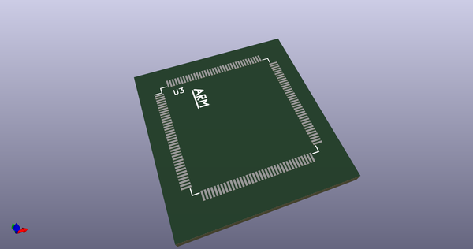
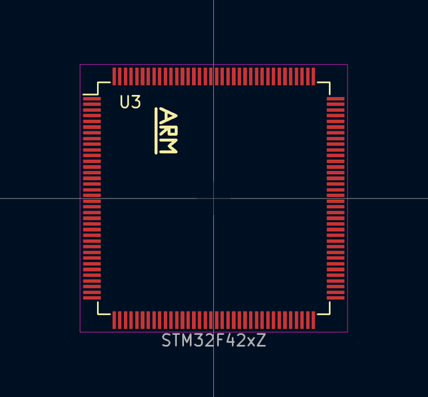
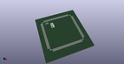

# OOMP Footprint  
## LQFP-144_ARM_20x20mm_Pitch0.5mm  by none  
  
oomp key: oomp_4ms_4ms_legacy_footprints_lqfp_144_arm_20x20mm_pitch0_5mm  
  
source repo at: [http://gitlab.com/4ms/4ms-kicad-lib/blob/master/tmp/data//oomlout_oomp_footprint_src/footprints-legacy/4ms-legacy-footprints.pretty/wire-hole.kicad_mod](http://gitlab.com/4ms/4ms-kicad-lib/blob/master/tmp/data//oomlout_oomp_footprint_src/footprints-legacy/4ms-legacy-footprints.pretty/wire-hole.kicad_mod)  
## Footprint  
  
  
  
  
| name | value | 
| --- | --- | 
| footprint name | LQFP-144_ARM_20x20mm_Pitch0.5mm | 
| footprint description | 144-Lead Plastic Low Profile Quad Flatpack (PL) - 20x20x1.40 mm Body [LQFP], 2.00 mm Footprint (see Microchip Packaging Specification 00000049BS.pdf) | 
| number of pads | 144 | 
| github path | http://github.com/4ms/4ms-kicad-lib/blob/master/tmp/data//oomlout_oomp_footprint_src/footprints-legacy/4ms-legacy-footprints.pretty/LQFP-144_ARM_20x20mm_Pitch0.5mm.kicad_mod | 
| oomp key | oomp_4ms_4ms_legacy_footprints_lqfp_144_arm_20x20mm_pitch0_5mm | 
| oomp bot github | https://github.com/oomlout/oomlout_oomp_footprint_bot/tree/main/tmp/data//oomlout_oomp_footprint_src/footprints/4ms_4ms_legacy_footprints_lqfp_144_arm_20x20mm_pitch0_5mm/working | 
## Images  
  
  
  
  
  
  
  
  
