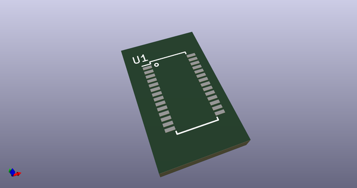
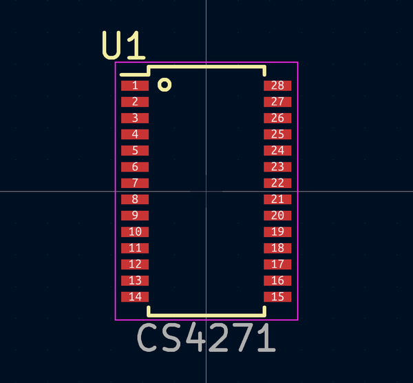
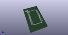
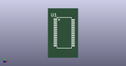

# OOMP Footprint  
## TSSOP-28_4.4x9.7mm_Pitch0.65mm  by none  
  
oomp key: oomp_4ms_4ms_legacy_footprints_tssop_28_4_4x9_7mm_pitch0_65mm  
  
source repo at: [http://gitlab.com/4ms/4ms-kicad-lib/blob/master/tmp/data//oomlout_oomp_footprint_src/footprints-legacy/4ms-legacy-footprints.pretty/wire-hole.kicad_mod](http://gitlab.com/4ms/4ms-kicad-lib/blob/master/tmp/data//oomlout_oomp_footprint_src/footprints-legacy/4ms-legacy-footprints.pretty/wire-hole.kicad_mod)  
## Footprint  
  
  
  
  
| name | value | 
| --- | --- | 
| footprint name | TSSOP-28_4.4x9.7mm_Pitch0.65mm | 
| footprint description | TSSOP28: plastic thin shrink small outline package; 28 leads; body width 4.4 mm; (see NXP SSOP-TSSOP-VSO-REFLOW.pdf and sot361-1_po.pdf) | 
| number of pads | 28 | 
| github path | http://github.com/4ms/4ms-kicad-lib/blob/master/tmp/data//oomlout_oomp_footprint_src/footprints-legacy/4ms-legacy-footprints.pretty/TSSOP-28_4.4x9.7mm_Pitch0.65mm.kicad_mod | 
| oomp key | oomp_4ms_4ms_legacy_footprints_tssop_28_4_4x9_7mm_pitch0_65mm | 
| oomp bot github | https://github.com/oomlout/oomlout_oomp_footprint_bot/tree/main/tmp/data//oomlout_oomp_footprint_src/footprints/4ms_4ms_legacy_footprints_tssop_28_4_4x9_7mm_pitch0_65mm/working | 
## Images  
  
  
  
  
  
  
  
  
