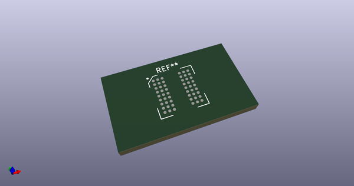
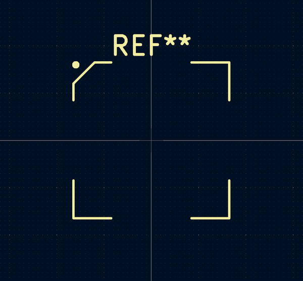
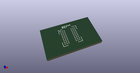
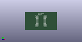

# OOMP Footprint  
## BGA-54_8.0x8.0mm_P0.8  by 4ms  
  
oomp key: oomp_4ms_4ms_package_qfp_bga_54_8_0x8_0mm_p0_8  
  
source repo at: [http://github.com/4ms/4ms-kicad-lib/blob/master/tmp/data//oomlout_oomp_footprint_src/footprints-legacy/4ms-legacy-footprints.pretty/wire-hole.kicad_mod](http://github.com/4ms/4ms-kicad-lib/blob/master/tmp/data//oomlout_oomp_footprint_src/footprints-legacy/4ms-legacy-footprints.pretty/wire-hole.kicad_mod)  
## Footprint  
  
  
  
  
| name | value | 
| --- | --- | 
| footprint name | BGA-54_8.0x8.0mm_P0.8 | 
| footprint description | None | 
| number of pads | 54 | 
| github path | http://github.com/4ms/4ms-kicad-lib/blob/master/tmp/data//oomlout_oomp_footprint_src/footprints/4ms_Package_QFP.pretty/BGA-54_8.0x8.0mm_P0.8.kicad_mod | 
| oomp key | oomp_4ms_4ms_package_qfp_bga_54_8_0x8_0mm_p0_8 | 
| oomp bot github | https://github.com/oomlout/oomlout_oomp_footprint_bot/tree/main/tmp/data//oomlout_oomp_footprint_src/footprints/4ms_4ms_package_qfp_bga_54_8_0x8_0mm_p0_8/working | 
## Images  
  
  
  
  
  
  
  
  
