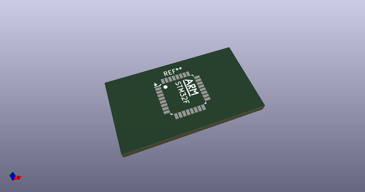
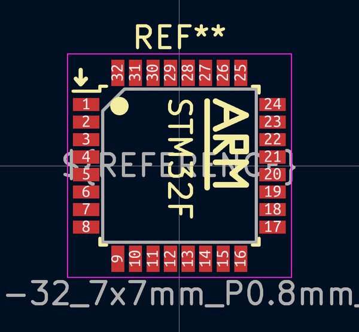
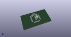

# OOMP Footprint  
## LQFP-32_7x7mm_P0.8mm_ARM  by 4ms  
  
oomp key: oomp_4ms_4ms_package_qfp_lqfp_32_7x7mm_p0_8mm_arm  
  
source repo at: [http://github.com/4ms/4ms-kicad-lib/blob/master/tmp/data/oomlout_oomp_footprint_src/footprints-legacy/4ms-legacy-footprints.pretty/wire-hole.kicad_mod](http://github.com/4ms/4ms-kicad-lib/blob/master/tmp/data/oomlout_oomp_footprint_src/footprints-legacy/4ms-legacy-footprints.pretty/wire-hole.kicad_mod)  
## Footprint  
  
  
  
  
| name | value | 
| --- | --- | 
| footprint name | LQFP-32_7x7mm_P0.8mm_ARM | 
| footprint description | LQFP32: plastic low profile quad flat package; 32 leads; body 7 x 7 x 1.4 mm (see NXP sot358-1_po.pdf and sot358-1_fr.pdf) | 
| number of pads | 32 | 
| github path | http://github.com/4ms/4ms-kicad-lib/blob/master/tmp/data/oomlout_oomp_footprint_src/footprints/4ms_Package_QFP.pretty/LQFP-32_7x7mm_P0.8mm_ARM.kicad_mod | 
| oomp key | oomp_4ms_4ms_package_qfp_lqfp_32_7x7mm_p0_8mm_arm | 
| oomp bot github | https://github.com/oomlout/oomlout_oomp_footprint_bot/tree/main/tmp/data/oomlout_oomp_footprint_src/footprints/4ms_4ms_package_qfp_lqfp_32_7x7mm_p0_8mm_arm/working | 
## Images  
  
  
  
  
  
  
  
  
