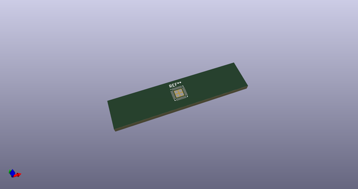
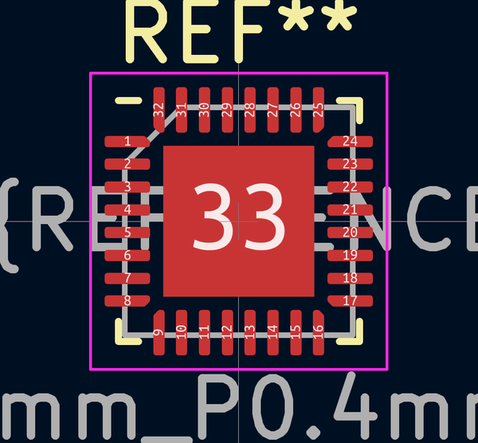
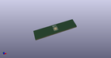
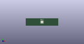

# OOMP Footprint  
## QFN-32-1EP_4x4mm_P0.4mm_EP2.65x2.65mm  by 4ms  
  
oomp key: oomp_4ms_4ms_package_qfp_qfn_32_1ep_4x4mm_p0_4mm_ep2_65x2_65mm  
  
source repo at: [http://github.com/4ms/4ms-kicad-lib/blob/master/tmp/data//oomlout_oomp_footprint_src/footprints-legacy/4ms-legacy-footprints.pretty/wire-hole.kicad_mod](http://github.com/4ms/4ms-kicad-lib/blob/master/tmp/data//oomlout_oomp_footprint_src/footprints-legacy/4ms-legacy-footprints.pretty/wire-hole.kicad_mod)  
## Footprint  
  
  
  
  
| name | value | 
| --- | --- | 
| footprint name | QFN-32-1EP_4x4mm_P0.4mm_EP2.65x2.65mm | 
| footprint description | QFN, 32 Pin (https://www.renesas.com/eu/en/package-image/pdf/outdrawing/l32.4x4a.pdf), generated with kicad-footprint-generator ipc_noLead_generator.py | 
| number of pads | 37 | 
| github path | http://github.com/4ms/4ms-kicad-lib/blob/master/tmp/data//oomlout_oomp_footprint_src/footprints/4ms_Package_QFP.pretty/QFN-32-1EP_4x4mm_P0.4mm_EP2.65x2.65mm.kicad_mod | 
| oomp key | oomp_4ms_4ms_package_qfp_qfn_32_1ep_4x4mm_p0_4mm_ep2_65x2_65mm | 
| oomp bot github | https://github.com/oomlout/oomlout_oomp_footprint_bot/tree/main/tmp/data//oomlout_oomp_footprint_src/footprints/4ms_4ms_package_qfp_qfn_32_1ep_4x4mm_p0_4mm_ep2_65x2_65mm/working | 
## Images  
  
  
  
  
  
  
  
  
