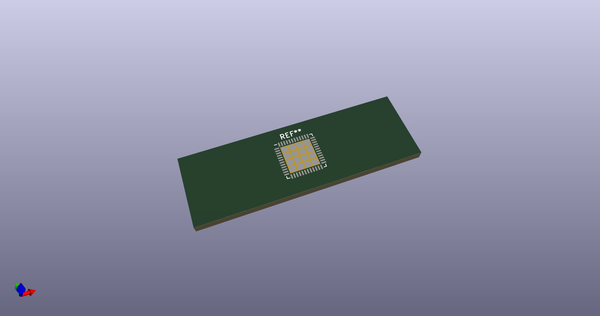
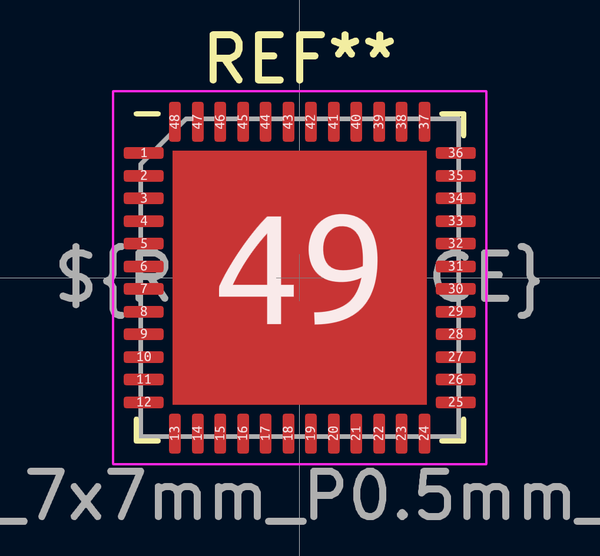
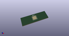

# OOMP Footprint  
## QFN-48-1EP_7x7mm_P0.5mm_EP5.6x5.6mm  by none  
  
oomp key: oomp_4ms_4ms_package_qfp_qfn_48_1ep_7x7mm_p0_5mm_ep5_6x5_6mm  
  
source repo at: [http://gitlab.com/4ms/4ms-kicad-lib/blob/master/tmp/data//oomlout_oomp_footprint_src/footprints-legacy/4ms-legacy-footprints.pretty/wire-hole.kicad_mod](http://gitlab.com/4ms/4ms-kicad-lib/blob/master/tmp/data//oomlout_oomp_footprint_src/footprints-legacy/4ms-legacy-footprints.pretty/wire-hole.kicad_mod)  
## Footprint  
  
  
  
  
| name | value | 
| --- | --- | 
| footprint name | QFN-48-1EP_7x7mm_P0.5mm_EP5.6x5.6mm | 
| footprint description | QFN, 48 Pin (http://www.st.com/resource/en/datasheet/stm32f042k6.pdf#page=94), generated with kicad-footprint-generator ipc_noLead_generator.py | 
| number of pads | 65 | 
| github path | http://github.com/4ms/4ms-kicad-lib/blob/master/tmp/data//oomlout_oomp_footprint_src/footprints/4ms_Package_QFP.pretty/QFN-48-1EP_7x7mm_P0.5mm_EP5.6x5.6mm.kicad_mod | 
| oomp key | oomp_4ms_4ms_package_qfp_qfn_48_1ep_7x7mm_p0_5mm_ep5_6x5_6mm | 
| oomp bot github | https://github.com/oomlout/oomlout_oomp_footprint_bot/tree/main/tmp/data//oomlout_oomp_footprint_src/footprints/4ms_4ms_package_qfp_qfn_48_1ep_7x7mm_p0_5mm_ep5_6x5_6mm/working | 
## Images  
  
  
  
  
  
  
  
  
