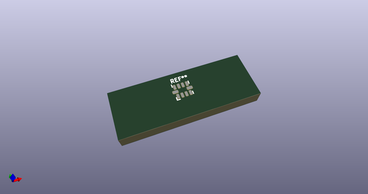
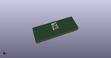

# OOMP Footprint  
## Texas-X2QFN-10_1.5x2mm_Pitch0.5mm  by 4ms  
  
oomp key: oomp_4ms_4ms_package_qfp_texas_x2qfn_10_1_5x2mm_pitch0_5mm  
  
source repo at: [http://github.com/4ms/4ms-kicad-lib/blob/master/tmp/data/oomlout_oomp_footprint_src/footprints-legacy/4ms-legacy-footprints.pretty/wire-hole.kicad_mod](http://github.com/4ms/4ms-kicad-lib/blob/master/tmp/data/oomlout_oomp_footprint_src/footprints-legacy/4ms-legacy-footprints.pretty/wire-hole.kicad_mod)  
## Footprint  
  
  
  
  
| name | value | 
| --- | --- | 
| footprint name | Texas-X2QFN-10_1.5x2mm_Pitch0.5mm | 
| footprint description | Texas  X2QFN, 10 Pin, 1.5mm x 2mm, Pitch 0.5mm | 
| number of pads | 10 | 
| github path | http://github.com/4ms/4ms-kicad-lib/blob/master/tmp/data/oomlout_oomp_footprint_src/footprints/4ms_Package_QFP.pretty/Texas-X2QFN-10_1.5x2mm_Pitch0.5mm.kicad_mod | 
| oomp key | oomp_4ms_4ms_package_qfp_texas_x2qfn_10_1_5x2mm_pitch0_5mm | 
| oomp bot github | https://github.com/oomlout/oomlout_oomp_footprint_bot/tree/main/tmp/data/oomlout_oomp_footprint_src/footprints/4ms_4ms_package_qfp_texas_x2qfn_10_1_5x2mm_pitch0_5mm/working | 
## Images  
  
  
  
  
  
  
  
  
