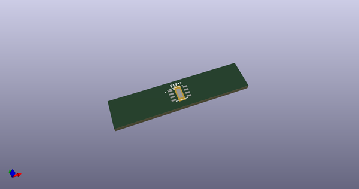
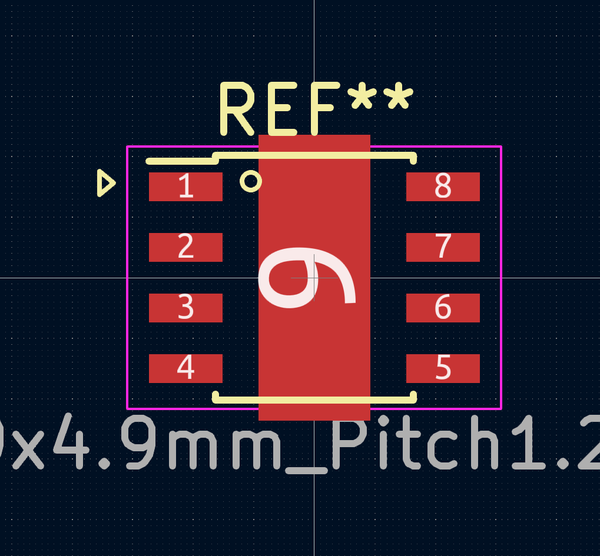
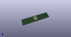

# OOMP Footprint  
## SOIC-8-1EP_3.9x4.9mm_Pitch1.27mm_HandSolder  by none  
  
oomp key: oomp_4ms_4ms_package_soic_soic_8_1ep_3_9x4_9mm_pitch1_27mm_handsolder  
  
source repo at: [http://gitlab.com/4ms/4ms-kicad-lib/blob/master/tmp/data//oomlout_oomp_footprint_src/footprints-legacy/4ms-legacy-footprints.pretty/wire-hole.kicad_mod](http://gitlab.com/4ms/4ms-kicad-lib/blob/master/tmp/data//oomlout_oomp_footprint_src/footprints-legacy/4ms-legacy-footprints.pretty/wire-hole.kicad_mod)  
## Footprint  
  
  
  
  
| name | value | 
| --- | --- | 
| footprint name | SOIC-8-1EP_3.9x4.9mm_Pitch1.27mm_HandSolder | 
| footprint description | 8-Lead Thermally Enhanced Plastic Small Outline (SE) - Narrow, 3.90 mm Body [SOIC] (see Microchip Packaging Specification 00000049BS.pdf) | 
| number of pads | 9 | 
| github path | http://github.com/4ms/4ms-kicad-lib/blob/master/tmp/data//oomlout_oomp_footprint_src/footprints/4ms_Package_SOIC.pretty/SOIC-8-1EP_3.9x4.9mm_Pitch1.27mm_HandSolder.kicad_mod | 
| oomp key | oomp_4ms_4ms_package_soic_soic_8_1ep_3_9x4_9mm_pitch1_27mm_handsolder | 
| oomp bot github | https://github.com/oomlout/oomlout_oomp_footprint_bot/tree/main/tmp/data//oomlout_oomp_footprint_src/footprints/4ms_4ms_package_soic_soic_8_1ep_3_9x4_9mm_pitch1_27mm_handsolder/working | 
## Images  
  
  
  
  
  
  
  
  
