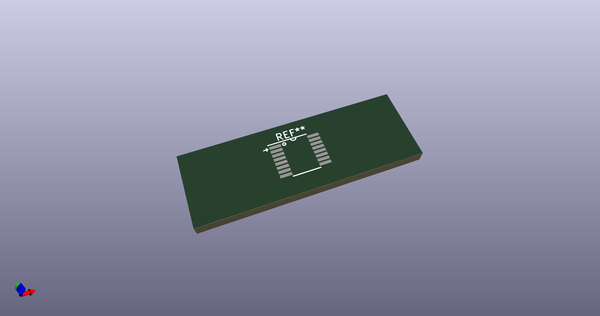
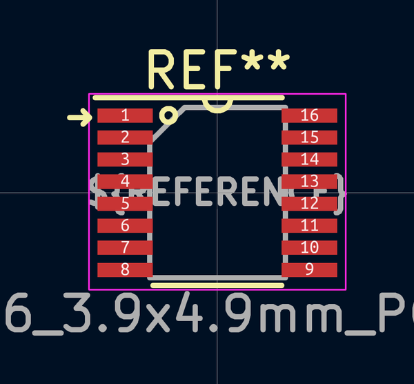
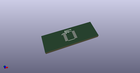

# OOMP Footprint  
## QSOP-16_3.9x4.9mm_P0.635mm  by 4ms  
  
oomp key: oomp_4ms_4ms_package_ssop_qsop_16_3_9x4_9mm_p0_635mm  
  
source repo at: [http://github.com/4ms/4ms-kicad-lib/blob/master/tmp/data//oomlout_oomp_footprint_src/footprints-legacy/4ms-legacy-footprints.pretty/wire-hole.kicad_mod](http://github.com/4ms/4ms-kicad-lib/blob/master/tmp/data//oomlout_oomp_footprint_src/footprints-legacy/4ms-legacy-footprints.pretty/wire-hole.kicad_mod)  
## Footprint  
  
  
  
  
| name | value | 
| --- | --- | 
| footprint name | QSOP-16_3.9x4.9mm_P0.635mm | 
| footprint description | 16-Lead Plastic Shrink Small Outline Narrow Body (QR)-.150" Body [QSOP] (see Microchip Packaging Specification 00000049BS.pdf) | 
| number of pads | 16 | 
| github path | http://github.com/4ms/4ms-kicad-lib/blob/master/tmp/data//oomlout_oomp_footprint_src/footprints/4ms_Package_SSOP.pretty/QSOP-16_3.9x4.9mm_P0.635mm.kicad_mod | 
| oomp key | oomp_4ms_4ms_package_ssop_qsop_16_3_9x4_9mm_p0_635mm | 
| oomp bot github | https://github.com/oomlout/oomlout_oomp_footprint_bot/tree/main/tmp/data//oomlout_oomp_footprint_src/footprints/4ms_4ms_package_ssop_qsop_16_3_9x4_9mm_p0_635mm/working | 
## Images  
  
  
  
  
  
  
