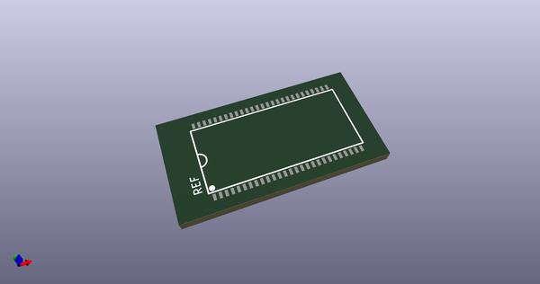

# OOMP Footprint  
## TSOP-54_11.76x22.22mm_Pitch0.8mm  by none  
  
oomp key: oomp_4ms_4ms_package_ssop_tsop_54_11_76x22_22mm_pitch0_8mm  
  
source repo at: [http://gitlab.com/4ms/4ms-kicad-lib/blob/master/tmp/data//oomlout_oomp_footprint_src/footprints-legacy/4ms-legacy-footprints.pretty/wire-hole.kicad_mod](http://gitlab.com/4ms/4ms-kicad-lib/blob/master/tmp/data//oomlout_oomp_footprint_src/footprints-legacy/4ms-legacy-footprints.pretty/wire-hole.kicad_mod)  
## Footprint  
  
  
  
  
| name | value | 
| --- | --- | 
| footprint name | TSOP-54_11.76x22.22mm_Pitch0.8mm | 
| footprint description | http://download.micron.com/pdf/datasheets/dram/sdram/256MSDRAM.pdf | 
| number of pads | 54 | 
| github path | http://github.com/4ms/4ms-kicad-lib/blob/master/tmp/data//oomlout_oomp_footprint_src/footprints/4ms_Package_SSOP.pretty/TSOP-54_11.76x22.22mm_Pitch0.8mm.kicad_mod | 
| oomp key | oomp_4ms_4ms_package_ssop_tsop_54_11_76x22_22mm_pitch0_8mm | 
| oomp bot github | https://github.com/oomlout/oomlout_oomp_footprint_bot/tree/main/tmp/data//oomlout_oomp_footprint_src/footprints/4ms_4ms_package_ssop_tsop_54_11_76x22_22mm_pitch0_8mm/working | 
## Images  
  
  
  
  
  
  
  
  
