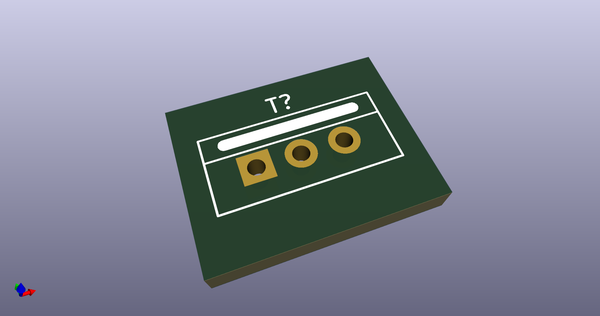
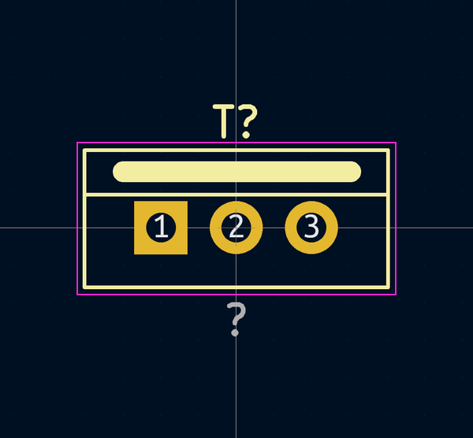
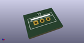

# OOMP Footprint  
## TO-220-3_Vertical  by 4ms  
  
oomp key: oomp_4ms_4ms_package_to_to_220_3_vertical  
  
source repo at: [http://github.com/4ms/4ms-kicad-lib/blob/master/tmp/data/oomlout_oomp_footprint_src/footprints-legacy/4ms-legacy-footprints.pretty/wire-hole.kicad_mod](http://github.com/4ms/4ms-kicad-lib/blob/master/tmp/data/oomlout_oomp_footprint_src/footprints-legacy/4ms-legacy-footprints.pretty/wire-hole.kicad_mod)  
## Footprint  
  
  
  
  
| name | value | 
| --- | --- | 
| footprint name | TO-220-3_Vertical | 
| footprint description | TO-220, Vertical, RM 2.54mm | 
| number of pads | 3 | 
| github path | http://github.com/4ms/4ms-kicad-lib/blob/master/tmp/data/oomlout_oomp_footprint_src/footprints/4ms_Package_TO.pretty/TO-220-3_Vertical.kicad_mod | 
| oomp key | oomp_4ms_4ms_package_to_to_220_3_vertical | 
| oomp bot github | https://github.com/oomlout/oomlout_oomp_footprint_bot/tree/main/tmp/data/oomlout_oomp_footprint_src/footprints/4ms_4ms_package_to_to_220_3_vertical/working | 
## Images  
  
  
  
  
  
  
  
  
