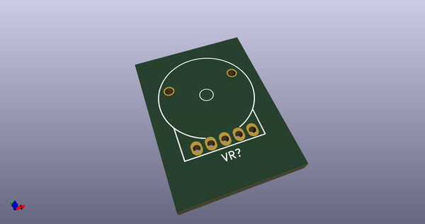
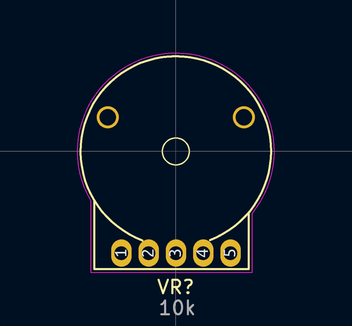
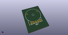
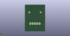
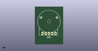

# OOMP Footprint  
## Pot_Wheel_Dual_TH_AlpsRK10J1xA  by 4ms  
  
oomp key: oomp_4ms_4ms_potentiometer_pot_wheel_dual_th_alpsrk10j1xa  
  
source repo at: [http://github.com/4ms/4ms-kicad-lib/blob/master/tmp/data/oomlout_oomp_footprint_src/footprints-legacy/4ms-legacy-footprints.pretty/wire-hole.kicad_mod](http://github.com/4ms/4ms-kicad-lib/blob/master/tmp/data/oomlout_oomp_footprint_src/footprints-legacy/4ms-legacy-footprints.pretty/wire-hole.kicad_mod)  
## Footprint  
  
  
  
  
| name | value | 
| --- | --- | 
| footprint name | Pot_Wheel_Dual_TH_AlpsRK10J1xA | 
| footprint description | http://www.alps.com/prod/info/E/HTML/Potentiometer/RotaryPotentiometers/RKJ1/RK14J12A0A0K.html | 
| number of pads | 7 | 
| github path | http://github.com/4ms/4ms-kicad-lib/blob/master/tmp/data/oomlout_oomp_footprint_src/footprints/4ms_Potentiometer.pretty/Pot_Wheel_Dual_TH_AlpsRK10J1xA.kicad_mod | 
| oomp key | oomp_4ms_4ms_potentiometer_pot_wheel_dual_th_alpsrk10j1xa | 
| oomp bot github | https://github.com/oomlout/oomlout_oomp_footprint_bot/tree/main/tmp/data/oomlout_oomp_footprint_src/footprints/4ms_4ms_potentiometer_pot_wheel_dual_th_alpsrk10j1xa/working | 
## Images  
  
  
  
  
  
  
  
  
