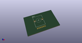

# OOMP Footprint  
## Potentiometer_Alpha_RV112_Dual_Vert_Knurled  by 4ms  
  
oomp key: oomp_4ms_4ms_potentiometer_potentiometer_alpha_rv112_dual_vert_knurled  
  
source repo at: [http://github.com/4ms/4ms-kicad-lib/blob/master/tmp/data//oomlout_oomp_footprint_src/footprints-legacy/4ms-legacy-footprints.pretty/wire-hole.kicad_mod](http://github.com/4ms/4ms-kicad-lib/blob/master/tmp/data//oomlout_oomp_footprint_src/footprints-legacy/4ms-legacy-footprints.pretty/wire-hole.kicad_mod)  
## Footprint  
  
  
  
  
| name | value | 
| --- | --- | 
| footprint name | Potentiometer_Alpha_RV112_Dual_Vert_Knurled | 
| footprint description | Potentiometer, vertical, Alps RK09L Double, http://www.alps.com/prod/info/E/HTML/Potentiometer/RotaryPotentiometers/RK09L/RK09L_list.html | 
| number of pads | 8 | 
| github path | http://github.com/4ms/4ms-kicad-lib/blob/master/tmp/data//oomlout_oomp_footprint_src/footprints/4ms_Potentiometer.pretty/Potentiometer_Alpha_RV112_Dual_Vert_Knurled.kicad_mod | 
| oomp key | oomp_4ms_4ms_potentiometer_potentiometer_alpha_rv112_dual_vert_knurled | 
| oomp bot github | https://github.com/oomlout/oomlout_oomp_footprint_bot/tree/main/tmp/data//oomlout_oomp_footprint_src/footprints/4ms_4ms_potentiometer_potentiometer_alpha_rv112_dual_vert_knurled/working | 
## Images  
  
  
  
  
  
  
  
  
