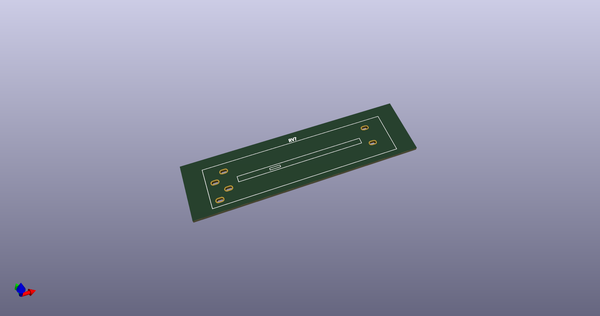
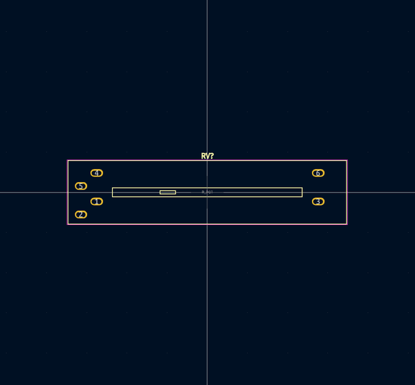
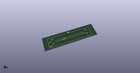
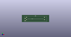

# OOMP Footprint  
## Slider_Dual_Top-Up_60RFT2-B  by 4ms  
  
oomp key: oomp_4ms_4ms_potentiometer_slider_dual_top_up_60rft2_b  
  
source repo at: [http://github.com/4ms/4ms-kicad-lib/blob/master/tmp/data//oomlout_oomp_footprint_src/footprints-legacy/4ms-legacy-footprints.pretty/wire-hole.kicad_mod](http://github.com/4ms/4ms-kicad-lib/blob/master/tmp/data//oomlout_oomp_footprint_src/footprints-legacy/4ms-legacy-footprints.pretty/wire-hole.kicad_mod)  
## Footprint  
  
  
  
  
| name | value | 
| --- | --- | 
| footprint name | Slider_Dual_Top-Up_60RFT2-B | 
| footprint description | Note: pinout different than datasheet on website. 60RFT2-B-C1M15-1B100K-07-6H: Lever=C1, LeverLength=M15mm, Res=B100k | 
| number of pads | 14 | 
| github path | http://github.com/4ms/4ms-kicad-lib/blob/master/tmp/data//oomlout_oomp_footprint_src/footprints/4ms_Potentiometer.pretty/Slider_Dual_Top-Up_60RFT2-B.kicad_mod | 
| oomp key | oomp_4ms_4ms_potentiometer_slider_dual_top_up_60rft2_b | 
| oomp bot github | https://github.com/oomlout/oomlout_oomp_footprint_bot/tree/main/tmp/data//oomlout_oomp_footprint_src/footprints/4ms_4ms_potentiometer_slider_dual_top_up_60rft2_b/working | 
## Images  
  
  
  
  
  
  
  
  
