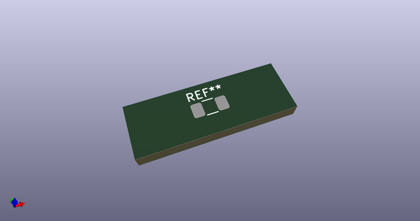
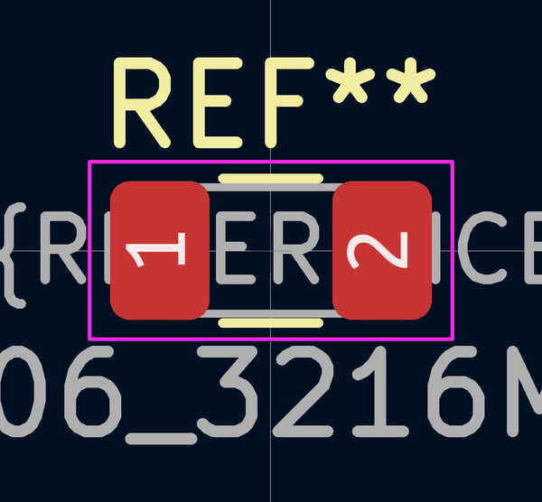
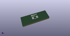

# OOMP Footprint  
## R_1206_3216Metric  by none  
  
oomp key: oomp_4ms_4ms_resistor_r_1206_3216metric  
  
source repo at: [http://gitlab.com/4ms/4ms-kicad-lib/blob/master/tmp/data//oomlout_oomp_footprint_src/footprints-legacy/4ms-legacy-footprints.pretty/wire-hole.kicad_mod](http://gitlab.com/4ms/4ms-kicad-lib/blob/master/tmp/data//oomlout_oomp_footprint_src/footprints-legacy/4ms-legacy-footprints.pretty/wire-hole.kicad_mod)  
## Footprint  
  
  
  
  
| name | value | 
| --- | --- | 
| footprint name | R_1206_3216Metric | 
| footprint description | Resistor SMD 1206 (3216 Metric), square (rectangular) end terminal, IPC_7351 nominal, (Body size source: http://www.tortai-tech.com/upload/download/2011102023233369053.pdf), generated with kicad-footprint-generator | 
| number of pads | 2 | 
| github path | http://github.com/4ms/4ms-kicad-lib/blob/master/tmp/data//oomlout_oomp_footprint_src/footprints/4ms_Resistor.pretty/R_1206_3216Metric.kicad_mod | 
| oomp key | oomp_4ms_4ms_resistor_r_1206_3216metric | 
| oomp bot github | https://github.com/oomlout/oomlout_oomp_footprint_bot/tree/main/tmp/data//oomlout_oomp_footprint_src/footprints/4ms_4ms_resistor_r_1206_3216metric/working | 
## Images  
  
  
  
  
  
  
