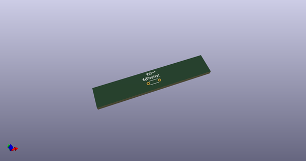
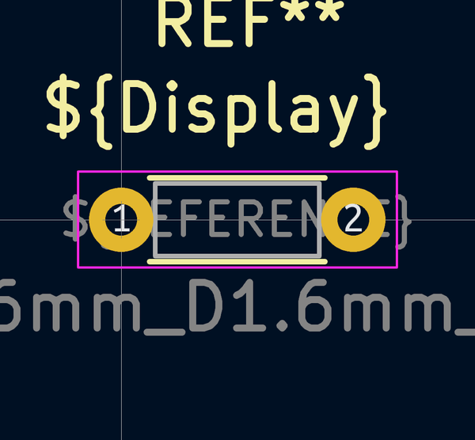
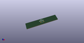

# OOMP Footprint  
## R_Axial_DIN0204_L3.6mm_D1.6mm_P5.08mm_Horizontal  by 4ms  
  
oomp key: oomp_4ms_4ms_resistor_r_axial_din0204_l3_6mm_d1_6mm_p5_08mm_horizontal  
  
source repo at: [http://github.com/4ms/4ms-kicad-lib/blob/master/tmp/data//oomlout_oomp_footprint_src/footprints-legacy/4ms-legacy-footprints.pretty/wire-hole.kicad_mod](http://github.com/4ms/4ms-kicad-lib/blob/master/tmp/data//oomlout_oomp_footprint_src/footprints-legacy/4ms-legacy-footprints.pretty/wire-hole.kicad_mod)  
## Footprint  
  
  
  
  
| name | value | 
| --- | --- | 
| footprint name | R_Axial_DIN0204_L3.6mm_D1.6mm_P5.08mm_Horizontal | 
| footprint description | Resistor, Axial_DIN0204 series, Axial, Horizontal, pin pitch=5.08mm, 0.167W, length*diameter=3.6*1.6mm^2, http://cdn-reichelt.de/documents/datenblatt/B400/1_4W%23YAG.pdf | 
| number of pads | 2 | 
| github path | http://github.com/4ms/4ms-kicad-lib/blob/master/tmp/data//oomlout_oomp_footprint_src/footprints/4ms_Resistor.pretty/R_Axial_DIN0204_L3.6mm_D1.6mm_P5.08mm_Horizontal.kicad_mod | 
| oomp key | oomp_4ms_4ms_resistor_r_axial_din0204_l3_6mm_d1_6mm_p5_08mm_horizontal | 
| oomp bot github | https://github.com/oomlout/oomlout_oomp_footprint_bot/tree/main/tmp/data//oomlout_oomp_footprint_src/footprints/4ms_4ms_resistor_r_axial_din0204_l3_6mm_d1_6mm_p5_08mm_horizontal/working | 
## Images  
  
  
  
  
  
  
  
  
