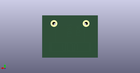

# OOMP Footprint  
## LDR_RtAngle_P300mil  by 4ms  
  
oomp key: oomp_4ms_4ms_sensor_ldr_rtangle_p300mil  
  
source repo at: [http://github.com/4ms/4ms-kicad-lib/blob/master/tmp/data/oomlout_oomp_footprint_src/footprints-legacy/4ms-legacy-footprints.pretty/wire-hole.kicad_mod](http://github.com/4ms/4ms-kicad-lib/blob/master/tmp/data/oomlout_oomp_footprint_src/footprints-legacy/4ms-legacy-footprints.pretty/wire-hole.kicad_mod)  
## Footprint  
  
  
  
  
| name | value | 
| --- | --- | 
| footprint name | LDR_RtAngle_P300mil | 
| footprint description | Resistor, LDR 10x8.5mm | 
| number of pads | 2 | 
| github path | http://github.com/4ms/4ms-kicad-lib/blob/master/tmp/data/oomlout_oomp_footprint_src/footprints/4ms_Sensor.pretty/LDR_RtAngle_P300mil.kicad_mod | 
| oomp key | oomp_4ms_4ms_sensor_ldr_rtangle_p300mil | 
| oomp bot github | https://github.com/oomlout/oomlout_oomp_footprint_bot/tree/main/tmp/data/oomlout_oomp_footprint_src/footprints/4ms_4ms_sensor_ldr_rtangle_p300mil/working | 
## Images  
  
  
  
  
  
  
