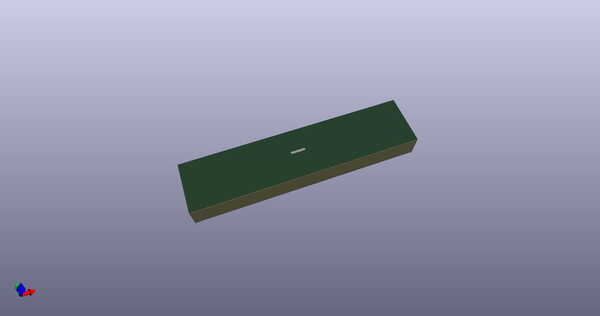
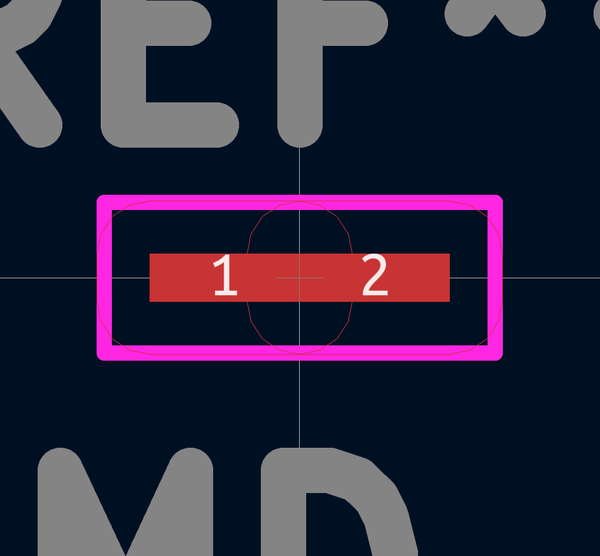
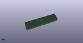

# OOMP Footprint  
## NetTie-2_SMD_Pad0.16mm_6mil  by 4ms  
  
oomp key: oomp_4ms_4ms_solderjumper_nettie_2_smd_pad0_16mm_6mil  
  
source repo at: [http://github.com/4ms/4ms-kicad-lib/blob/master/tmp/data//oomlout_oomp_footprint_src/footprints-legacy/4ms-legacy-footprints.pretty/wire-hole.kicad_mod](http://github.com/4ms/4ms-kicad-lib/blob/master/tmp/data//oomlout_oomp_footprint_src/footprints-legacy/4ms-legacy-footprints.pretty/wire-hole.kicad_mod)  
## Footprint  
  
  
  
  
| name | value | 
| --- | --- | 
| footprint name | NetTie-2_SMD_Pad0.16mm_6mil | 
| footprint description | Net tie, 2 pin, 0.16mm/6mil trace | 
| number of pads | 2 | 
| github path | http://github.com/4ms/4ms-kicad-lib/blob/master/tmp/data//oomlout_oomp_footprint_src/footprints/4ms_SolderJumper.pretty/NetTie-2_SMD_Pad0.16mm_6mil.kicad_mod | 
| oomp key | oomp_4ms_4ms_solderjumper_nettie_2_smd_pad0_16mm_6mil | 
| oomp bot github | https://github.com/oomlout/oomlout_oomp_footprint_bot/tree/main/tmp/data//oomlout_oomp_footprint_src/footprints/4ms_4ms_solderjumper_nettie_2_smd_pad0_16mm_6mil/working | 
## Images  
  
  
  
  
  
  
  
  
