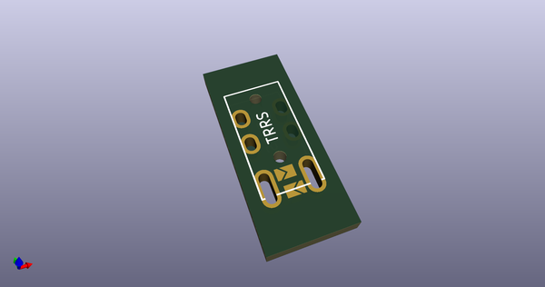
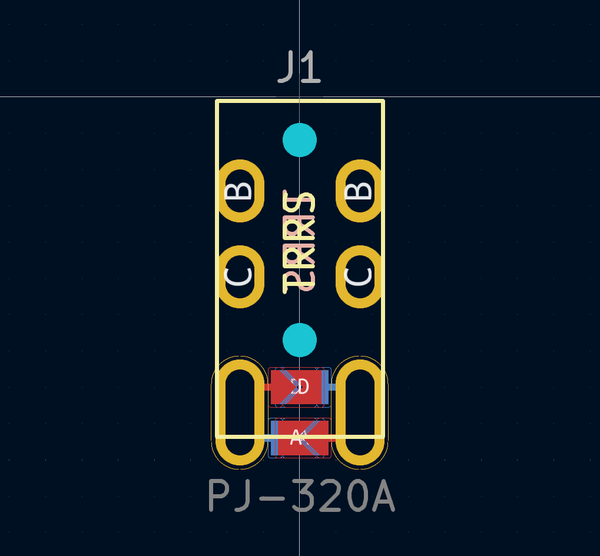
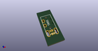
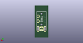
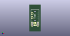

# OOMP Footprint  
## PJ-320A  by none  
  
oomp key: oomp_50an6xy06r6n_keyboard_reversible_pj_320a  
  
source repo at: [http://gitlab.com/50an6xy06r6n/keyboard_reversible.pretty/blob/master/tmp/data//oomlout_oomp_footprint_src/ProMicro_unrouted.kicad_mod](http://gitlab.com/50an6xy06r6n/keyboard_reversible.pretty/blob/master/tmp/data//oomlout_oomp_footprint_src/ProMicro_unrouted.kicad_mod)  
## Footprint  
  
  
  
  
| name | value | 
| --- | --- | 
| footprint name | PJ-320A | 
| footprint description | Solder-jumper reversible TRRS Socket | 
| number of pads | 22 | 
| github path | http://github.com/50an6xy06r6n/keyboard_reversible.pretty/blob/master/tmp/data//oomlout_oomp_footprint_src/PJ-320A.kicad_mod | 
| oomp key | oomp_50an6xy06r6n_keyboard_reversible_pj_320a | 
| oomp bot github | https://github.com/oomlout/oomlout_oomp_footprint_bot/tree/main/tmp/data//oomlout_oomp_footprint_src/footprints/50an6xy06r6n_keyboard_reversible_pj_320a/working | 
## Images  
  
  
  
  
  
  
