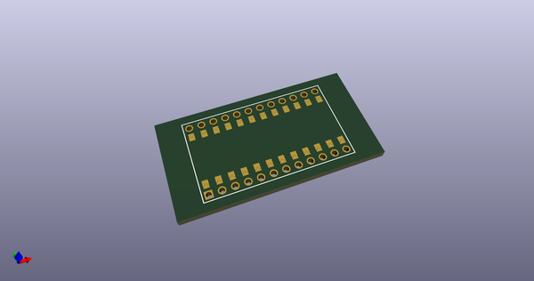
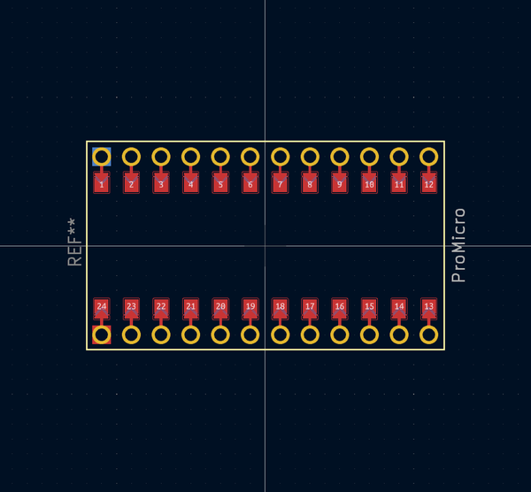
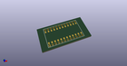
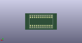
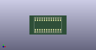

# OOMP Footprint  
## ProMicro_unrouted  by 50an6xy06r6n  
  
oomp key: oomp_50an6xy06r6n_keyboard_reversible_promicro_unrouted  
  
source repo at: [http://github.com/50an6xy06r6n/keyboard_reversible.pretty/blob/master/tmp/data/oomlout_oomp_footprint_src/ProMicro_unrouted.kicad_mod](http://github.com/50an6xy06r6n/keyboard_reversible.pretty/blob/master/tmp/data/oomlout_oomp_footprint_src/ProMicro_unrouted.kicad_mod)  
## Footprint  
  
  
  
  
| name | value | 
| --- | --- | 
| footprint name | ProMicro_unrouted | 
| footprint description | Solder-jumper reversible Pro Micro footprint (unrouted) | 
| number of pads | 170 | 
| github path | http://github.com/50an6xy06r6n/keyboard_reversible.pretty/blob/master/tmp/data/oomlout_oomp_footprint_src/ProMicro_unrouted.kicad_mod | 
| oomp key | oomp_50an6xy06r6n_keyboard_reversible_promicro_unrouted | 
| oomp bot github | https://github.com/oomlout/oomlout_oomp_footprint_bot/tree/main/tmp/data/oomlout_oomp_footprint_src/footprints/50an6xy06r6n_keyboard_reversible_promicro_unrouted/working | 
## Images  
  
  
  
  
  
  
  
  
