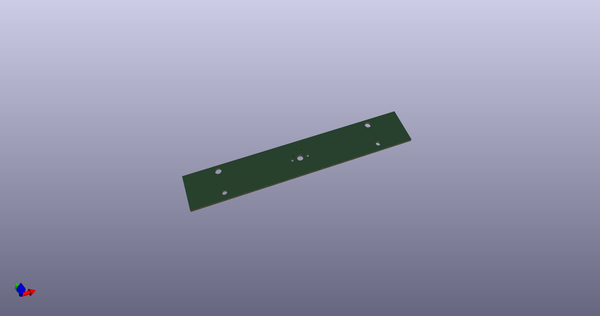
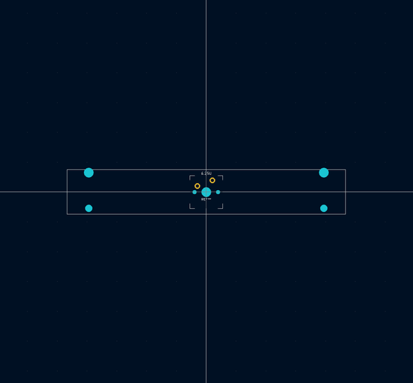
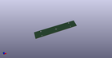
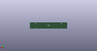
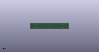

# OOMP Footprint  
## MX_19mm:MX_19mm-6.25U-ReversedStabilizers  by aaarsene  
  
oomp key: oomp_aaarsene_mx_19mm_mx_19mm_6_25u_reversedstabilizers_noled  
  
source repo at: [http://github.com/aaarsene/MX_19mm.pretty/blob/master/tmp/data/oomlout_oomp_footprint_src/MX_19mm-ISO-ROTATED-ReversedStabilizers-NoLED.kicad_mod](http://github.com/aaarsene/MX_19mm.pretty/blob/master/tmp/data/oomlout_oomp_footprint_src/MX_19mm-ISO-ROTATED-ReversedStabilizers-NoLED.kicad_mod)  
## Footprint  
  
  
  
  
| name | value | 
| --- | --- | 
| footprint name | MX_19mm:MX_19mm-6.25U-ReversedStabilizers | 
| footprint description | None | 
| number of pads | 9 | 
| github path | http://github.com/aaarsene/MX_19mm.pretty/blob/master/tmp/data/oomlout_oomp_footprint_src/MX_19mm-6.25U-ReversedStabilizers-NoLED.kicad_mod | 
| oomp key | oomp_aaarsene_mx_19mm_mx_19mm_6_25u_reversedstabilizers_noled | 
| oomp bot github | https://github.com/oomlout/oomlout_oomp_footprint_bot/tree/main/tmp/data/oomlout_oomp_footprint_src/footprints/aaarsene_mx_19mm_mx_19mm_6_25u_reversedstabilizers_noled/working | 
## Images  
  
  
  
  
  
  
  
  
