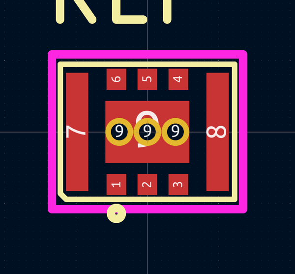
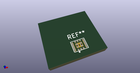

# OOMP Footprint  
## CL-2025-02  by aaronw2  
  
oomp key: oomp_aaronw2_torex_semi_cl_2025_02  
  
source repo at: [http://github.com/aaronw2/Torex_Semi.pretty/blob/master/tmp/data/oomlout_oomp_footprint_src/CL-2025-02.kicad_mod](http://github.com/aaronw2/Torex_Semi.pretty/blob/master/tmp/data/oomlout_oomp_footprint_src/CL-2025-02.kicad_mod)  
## Footprint  
  
  
  
  
| name | value | 
| --- | --- | 
| footprint name | CL-2025-02 | 
| footprint description | None | 
| number of pads | 12 | 
| github path | http://github.com/aaronw2/Torex_Semi.pretty/blob/master/tmp/data/oomlout_oomp_footprint_src/CL-2025-02.kicad_mod | 
| oomp key | oomp_aaronw2_torex_semi_cl_2025_02 | 
| oomp bot github | https://github.com/oomlout/oomlout_oomp_footprint_bot/tree/main/tmp/data/oomlout_oomp_footprint_src/footprints/aaronw2_torex_semi_cl_2025_02/working | 
## Images  
  
  
  
  
  
  
  
  
