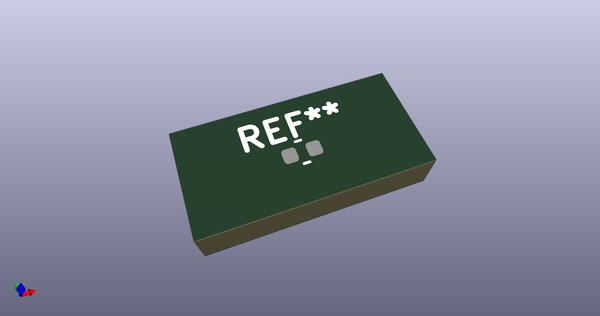
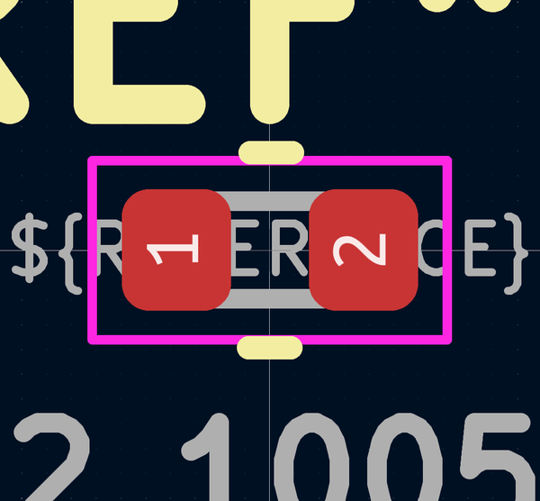

# OOMP Footprint  
## C_0402_1005Metric  by AcheronProject  
  
oomp key: oomp_acheronproject_acheron_components_c_0402_1005metric  
  
source repo at: [http://github.com/AcheronProject/acheron_Components.pretty/blob/master/tmp/data//oomlout_oomp_footprint_src/VQFN-16-1EP_3x3mm_P0.5mm_EP1.6x1.6mm.kicad_mod](http://github.com/AcheronProject/acheron_Components.pretty/blob/master/tmp/data//oomlout_oomp_footprint_src/VQFN-16-1EP_3x3mm_P0.5mm_EP1.6x1.6mm.kicad_mod)  
## Footprint  
  
  
  
  
| name | value | 
| --- | --- | 
| footprint name | C_0402_1005Metric | 
| footprint description | Capacitor SMD 0402 (1005 Metric), square (rectangular) end terminal, IPC_7351 nominal, (Body size source: IPC-SM-782 page 76, https://www.pcb-3d.com/wordpress/wp-content/uploads/ipc-sm-782a_amendment_1_and_2.pdf), generated with kicad-footprint-generator | 
| number of pads | 2 | 
| github path | http://github.com/AcheronProject/acheron_Components.pretty/blob/master/tmp/data//oomlout_oomp_footprint_src/C_0402_1005Metric.kicad_mod | 
| oomp key | oomp_acheronproject_acheron_components_c_0402_1005metric | 
| oomp bot github | https://github.com/oomlout/oomlout_oomp_footprint_bot/tree/main/tmp/data//oomlout_oomp_footprint_src/footprints/acheronproject_acheron_components_c_0402_1005metric/working | 
## Images  
  
  
  
  
  
  
