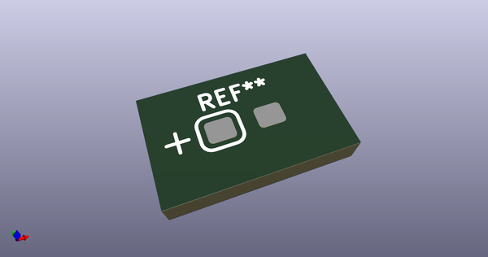
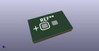

# OOMP Footprint  
## CP_EIA-3216-10_Kemet-I_Pad1.58x1.35mm_HandSolder  by none  
  
oomp key: oomp_acheronproject_acheron_components_cp_eia_3216_10_kemet_i_pad1_58x1_35mm_handsolder  
  
source repo at: [http://gitlab.com/AcheronProject/acheron_Components.pretty/blob/master/tmp/data//oomlout_oomp_footprint_src/VQFN-16-1EP_3x3mm_P0.5mm_EP1.6x1.6mm.kicad_mod](http://gitlab.com/AcheronProject/acheron_Components.pretty/blob/master/tmp/data//oomlout_oomp_footprint_src/VQFN-16-1EP_3x3mm_P0.5mm_EP1.6x1.6mm.kicad_mod)  
## Footprint  
  
  
  
  
| name | value | 
| --- | --- | 
| footprint name | CP_EIA-3216-10_Kemet-I_Pad1.58x1.35mm_HandSolder | 
| footprint description | Tantalum Capacitor SMD Kemet-I (3216-10 Metric), IPC_7351 nominal, (Body size from: http://www.kemet.com/Lists/ProductCatalog/Attachments/253/KEM_TC101_STD.pdf), generated with kicad-footprint-generator | 
| number of pads | 2 | 
| github path | http://github.com/AcheronProject/acheron_Components.pretty/blob/master/tmp/data//oomlout_oomp_footprint_src/CP_EIA-3216-10_Kemet-I_Pad1.58x1.35mm_HandSolder.kicad_mod | 
| oomp key | oomp_acheronproject_acheron_components_cp_eia_3216_10_kemet_i_pad1_58x1_35mm_handsolder | 
| oomp bot github | https://github.com/oomlout/oomlout_oomp_footprint_bot/tree/main/tmp/data//oomlout_oomp_footprint_src/footprints/acheronproject_acheron_components_cp_eia_3216_10_kemet_i_pad1_58x1_35mm_handsolder/working | 
## Images  
  
  
  
  
  
  
  
  
