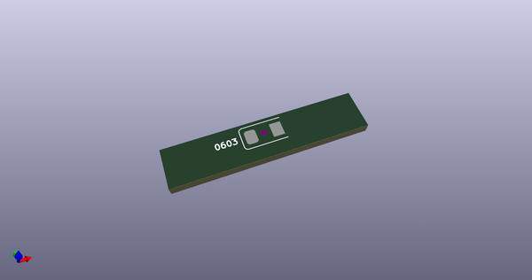
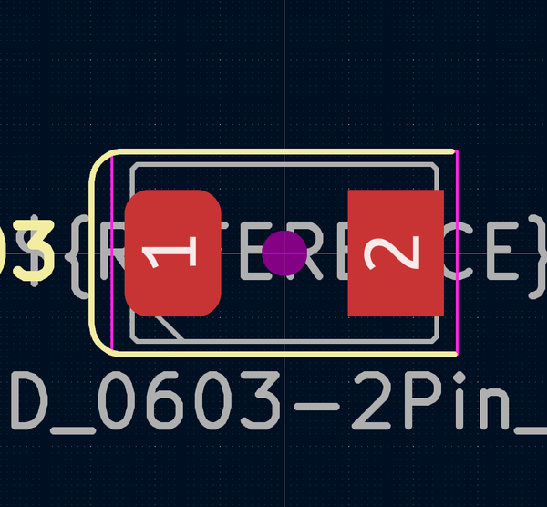
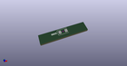
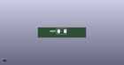

# OOMP Footprint  
## Crystal_SMD_0603-2Pin_6.0x3.5mm  by AcheronProject  
  
oomp key: oomp_acheronproject_acheron_components_crystal_smd_0603_2pin_6_0x3_5mm  
  
source repo at: [http://github.com/AcheronProject/acheron_Components.pretty/blob/master/tmp/data/oomlout_oomp_footprint_src/VQFN-16-1EP_3x3mm_P0.5mm_EP1.6x1.6mm.kicad_mod](http://github.com/AcheronProject/acheron_Components.pretty/blob/master/tmp/data/oomlout_oomp_footprint_src/VQFN-16-1EP_3x3mm_P0.5mm_EP1.6x1.6mm.kicad_mod)  
## Footprint  
  
  
  
  
| name | value | 
| --- | --- | 
| footprint name | Crystal_SMD_0603-2Pin_6.0x3.5mm | 
| footprint description | SMD Crystal SERIES SMD0603/2 http://www.petermann-technik.de/fileadmin/petermann/pdf/SMD0603-2.pdf, 6.0x3.5mm^2 package | 
| number of pads | 2 | 
| github path | http://github.com/AcheronProject/acheron_Components.pretty/blob/master/tmp/data/oomlout_oomp_footprint_src/Crystal_SMD_0603-2Pin_6.0x3.5mm.kicad_mod | 
| oomp key | oomp_acheronproject_acheron_components_crystal_smd_0603_2pin_6_0x3_5mm | 
| oomp bot github | https://github.com/oomlout/oomlout_oomp_footprint_bot/tree/main/tmp/data/oomlout_oomp_footprint_src/footprints/acheronproject_acheron_components_crystal_smd_0603_2pin_6_0x3_5mm/working | 
## Images  
  
  
  
  
  
  
  
  
