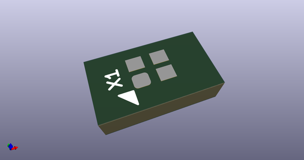
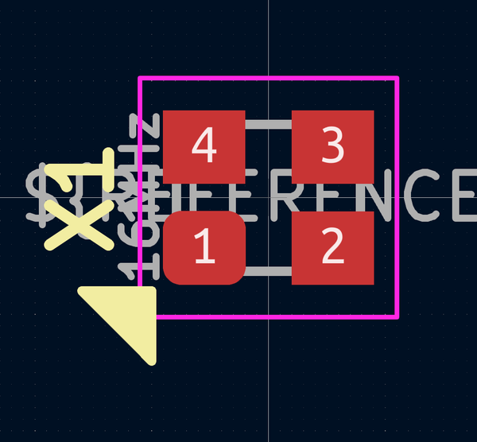

# OOMP Footprint  
## Crystal_SMD_2016-4Pin_2.0x1.6mm  by AcheronProject  
  
oomp key: oomp_acheronproject_acheron_components_crystal_smd_2016_4pin_2_0x1_6mm  
  
source repo at: [http://github.com/AcheronProject/acheron_Components.pretty/blob/master/tmp/data/oomlout_oomp_footprint_src/VQFN-16-1EP_3x3mm_P0.5mm_EP1.6x1.6mm.kicad_mod](http://github.com/AcheronProject/acheron_Components.pretty/blob/master/tmp/data/oomlout_oomp_footprint_src/VQFN-16-1EP_3x3mm_P0.5mm_EP1.6x1.6mm.kicad_mod)  
## Footprint  
  
  
  
  
| name | value | 
| --- | --- | 
| footprint name | Crystal_SMD_2016-4Pin_2.0x1.6mm | 
| footprint description | SMD Crystal SERIES SMD2016/4 http://www.q-crystal.com/upload/5/2015552223166229.pdf, 2.0x1.6mm^2 package | 
| number of pads | 4 | 
| github path | http://github.com/AcheronProject/acheron_Components.pretty/blob/master/tmp/data/oomlout_oomp_footprint_src/Crystal_SMD_2016-4Pin_2.0x1.6mm.kicad_mod | 
| oomp key | oomp_acheronproject_acheron_components_crystal_smd_2016_4pin_2_0x1_6mm | 
| oomp bot github | https://github.com/oomlout/oomlout_oomp_footprint_bot/tree/main/tmp/data/oomlout_oomp_footprint_src/footprints/acheronproject_acheron_components_crystal_smd_2016_4pin_2_0x1_6mm/working | 
## Images  
  
  
  
  
  
  
  
  
