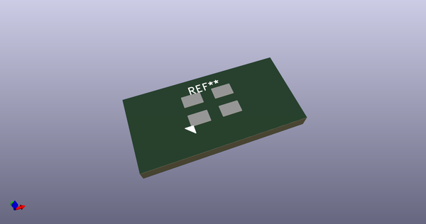
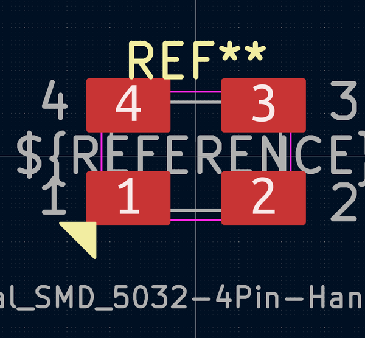
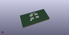

# OOMP Footprint  
## Crystal_SMD_5032-4Pin-HandSolder  by none  
  
oomp key: oomp_acheronproject_acheron_components_crystal_smd_5032_4pin_handsolder  
  
source repo at: [http://gitlab.com/AcheronProject/acheron_Components.pretty/blob/master/tmp/data//oomlout_oomp_footprint_src/VQFN-16-1EP_3x3mm_P0.5mm_EP1.6x1.6mm.kicad_mod](http://gitlab.com/AcheronProject/acheron_Components.pretty/blob/master/tmp/data//oomlout_oomp_footprint_src/VQFN-16-1EP_3x3mm_P0.5mm_EP1.6x1.6mm.kicad_mod)  
## Footprint  
  
  
  
  
| name | value | 
| --- | --- | 
| footprint name | Crystal_SMD_5032-4Pin-HandSolder | 
| footprint description | SMD Crystal SERIES SMD2520/4 http://www.icbase.com/File/PDF/HKC/HKC00061008.pdf, 5.0x3.2mm^2 package | 
| number of pads | 4 | 
| github path | http://github.com/AcheronProject/acheron_Components.pretty/blob/master/tmp/data//oomlout_oomp_footprint_src/Crystal_SMD_5032-4Pin-HandSolder.kicad_mod | 
| oomp key | oomp_acheronproject_acheron_components_crystal_smd_5032_4pin_handsolder | 
| oomp bot github | https://github.com/oomlout/oomlout_oomp_footprint_bot/tree/main/tmp/data//oomlout_oomp_footprint_src/footprints/acheronproject_acheron_components_crystal_smd_5032_4pin_handsolder/working | 
## Images  
  
  
  
  
  
  
  
  
