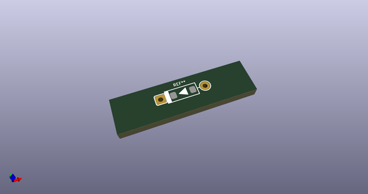
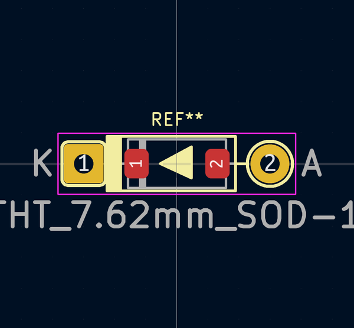
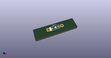

# OOMP Footprint  
## D_THT_7.62mm_SOD-123  by AcheronProject  
  
oomp key: oomp_acheronproject_acheron_components_d_tht_7_62mm_sod_123  
  
source repo at: [http://github.com/AcheronProject/acheron_Components.pretty/blob/master/tmp/data/oomlout_oomp_footprint_src/VQFN-16-1EP_3x3mm_P0.5mm_EP1.6x1.6mm.kicad_mod](http://github.com/AcheronProject/acheron_Components.pretty/blob/master/tmp/data/oomlout_oomp_footprint_src/VQFN-16-1EP_3x3mm_P0.5mm_EP1.6x1.6mm.kicad_mod)  
## Footprint  
  
  
  
  
| name | value | 
| --- | --- | 
| footprint name | D_THT_7.62mm_SOD-123 | 
| footprint description | Diode, DO-35_SOD27 series, Axial, Horizontal, pin pitch=7.62mm, , length*diameter=4*2mm^2, , http://www.diodes.com/_files/packages/DO-35.pdf | 
| number of pads | 4 | 
| github path | http://github.com/AcheronProject/acheron_Components.pretty/blob/master/tmp/data/oomlout_oomp_footprint_src/D_THT_7.62mm_SOD-123.kicad_mod | 
| oomp key | oomp_acheronproject_acheron_components_d_tht_7_62mm_sod_123 | 
| oomp bot github | https://github.com/oomlout/oomlout_oomp_footprint_bot/tree/main/tmp/data/oomlout_oomp_footprint_src/footprints/acheronproject_acheron_components_d_tht_7_62mm_sod_123/working | 
## Images  
  
  
  
  
  
  
