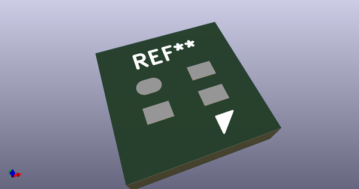
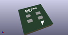

# OOMP Footprint  
## LED_WS2812B-Mini_3.5x3.5mm  by AcheronProject  
  
oomp key: oomp_acheronproject_acheron_components_led_ws2812b_mini_3_5x3_5mm  
  
source repo at: [http://github.com/AcheronProject/acheron_Components.pretty/blob/master/tmp/data//oomlout_oomp_footprint_src/VQFN-16-1EP_3x3mm_P0.5mm_EP1.6x1.6mm.kicad_mod](http://github.com/AcheronProject/acheron_Components.pretty/blob/master/tmp/data//oomlout_oomp_footprint_src/VQFN-16-1EP_3x3mm_P0.5mm_EP1.6x1.6mm.kicad_mod)  
## Footprint  
  
  
  
  
| name | value | 
| --- | --- | 
| footprint name | LED_WS2812B-Mini_3.5x3.5mm | 
| footprint description | https://e-neon.ru/catalog_files/pdf2/ws2812b-mini(3535)%20datasheet-v1.0.pdf | 
| number of pads | 4 | 
| github path | http://github.com/AcheronProject/acheron_Components.pretty/blob/master/tmp/data//oomlout_oomp_footprint_src/LED_WS2812B-Mini_3.5x3.5mm.kicad_mod | 
| oomp key | oomp_acheronproject_acheron_components_led_ws2812b_mini_3_5x3_5mm | 
| oomp bot github | https://github.com/oomlout/oomlout_oomp_footprint_bot/tree/main/tmp/data//oomlout_oomp_footprint_src/footprints/acheronproject_acheron_components_led_ws2812b_mini_3_5x3_5mm/working | 
## Images  
  
  
  
  
  
  
  
  
